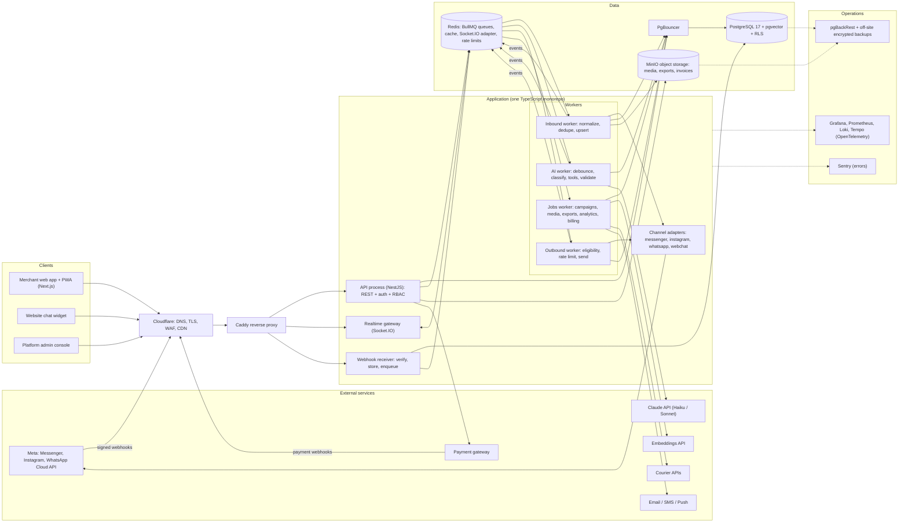

# Technical Architecture — AI Social Commerce SaaS

2026-10-09 · PM Dev

## Summary and assumptions

**Recommendation: one TypeScript modular monolith with separate worker processes, on a single shared PostgreSQL database with `tenant_id` on every row and Row-Level Security as a second safety net.** It is the simplest design one developer can build, operate and debug, and it scales to 10,000 merchants by adding machines, not by rewriting.

Design assumptions from your answers:

- **Team:** solo founder building with Claude Code. Every choice favours fewer moving parts, one language, and boring, well-documented tools Claude Code knows well.

- **Language:** TypeScript end to end (frontend, API, workers, shared types).

- **Hosting:** VPS in a Bangladesh data center. No managed cloud services, so the design names self-hosted options and spells out backups and monitoring you must run yourself.

- **Load targets (from the blueprint, not yet validated):** 1,000 merchants, 100,000 inbound messages/day, bursts of 50/s. At 10,000 merchants, plan for about 1M messages/day and bursts of 500/s.

- **Feature scope:** Phase 1 is your own shop (one workspace, Messenger DMs and comments). The design stays multi-tenant so Phase 2 can open signup to other merchants without a rewrite.

## Component diagram

All traffic enters through one edge proxy; the API process only accepts, validates and stores, and every slow or external call happens in workers fed by queues.



The API, realtime gateway, webhook receiver and workers are one codebase deployed as separate processes, so each can be scaled or restarted on its own. In Phase 1, the API and realtime gateway can share one process; the webhook receiver stays separate because it must always answer Meta quickly. Workers publish domain events to Redis; the realtime gateway pushes them to browsers.

## Tech stack

One language, one repo, one database: the stack keeps the blueprint's choices and fills in the parts it left open. Every item is self-hostable on a VPS.

| Layer              | Choice                                                                                             | Why this, for a solo TypeScript founder                                                                                                                            |
|--------------------|----------------------------------------------------------------------------------------------------|--------------------------------------------------------------------------------------------------------------------------------------------------------------------|
| Repo               | pnpm workspaces + Turborepo                                                                        | Shared types and Zod schemas between frontend, API and workers; one CI pipeline                                                                                    |
| Frontend           | Next.js (App Router), Tailwind, shadcn/ui, TanStack Query                                          | Blueprint choice; huge ecosystem; installable as a PWA for merchants on phones                                                                                     |
| API and workers    | NestJS on the Fastify adapter                                                                      | Modules map to the PRD modules; guards and interceptors make RBAC and tenant context hard to forget; Claude Code writes it well                                    |
| Validation         | Zod, shared package                                                                                | Same schema validates forms, API input and AI tool arguments                                                                                                       |
| Database           | PostgreSQL 17+ with pgvector and pg_trgm                                                           | Relational truth for orders and money, vectors for knowledge search, trigram search for Bangla text, all in one system to back up                                  |
| ORM / queries      | Drizzle ORM                                                                                        | Typed, close to SQL, works cleanly with RLS session variables and partitioned tables; Prisma is the alternative if you prefer it, but RLS needs extra wiring there |
| Connection pool    | PgBouncer (transaction mode)                                                                       | Many worker processes, few database connections; `SET LOCAL` tenant context works per transaction                                                                  |
| Queues             | BullMQ on Redis 7 (or Valkey)                                                                      | Retries, delays, backoff, rate limits and dashboards out of the box; Node-native                                                                                   |
| Realtime           | Socket.IO with the Redis adapter                                                                   | Rooms, reconnection and acknowledgements built in; scales across processes through Redis                                                                           |
| Object storage     | S3-compatible, self-hosted (MinIO or SeaweedFS)                                                    | Same S3 API as cloud, so moving to Cloudflare R2 or similar later is a config change; check the current licence and support terms of the store you pick            |
| Auth               | Better Auth (self-hosted library)                                                                  | Sessions, organizations, 2FA and OAuth in TypeScript, data stays in your Postgres                                                                                  |
| AI                 | Anthropic TypeScript SDK; Claude Haiku 5.5 for classification, Claude Sonnet 5.5 for sales replies | Tool use for typed product and order tools; model names in config per agent version                                                                                |
| Embeddings         | Multilingual embeddings API (for example Voyage multilingual)                                      | Choose by a small Bangla/Banglish retrieval test before committing                                                                                                 |
| Search             | Postgres full-text (simple config) + pg_trgm; Meilisearch later                                    | No extra service in MVP; Postgres has no Bangla stemmer, so trigram matching does the heavy lifting                                                                |
| Email / SMS / push | Transactional email provider, a local BD SMS gateway for OTP, Web Push (VAPID)                     | Push works on Android PWAs, which most merchants use                                                                                                               |
| Observability      | OpenTelemetry → Prometheus, Loki, Tempo, Grafana; Sentry for errors                                | One dashboard for metrics, logs and traces; free self-hosted                                                                                                       |
| Deploy             | Docker Compose, Caddy, GitHub Actions                                                              | Simple to operate alone; move to k3s only past about three app servers                                                                                             |
| Tests              | Vitest, Testcontainers (real Postgres/Redis), Playwright                                           | Tenant-isolation and webhook tests run against real services                                                                                                       |

Not chosen, on purpose: microservices (operational load for one person), Kafka (BullMQ covers the volume up to 10,000 merchants), a separate vector database (pgvector is enough at this size), MongoDB (orders and money need transactions and constraints).

## Multi-tenancy strategy

**Decision: shared database, shared schema, `tenant_id` on every tenant-owned row, enforced twice — in application code and by PostgreSQL Row-Level Security.** Schema-per-tenant does not pay off for thousands of small merchants who each pay BDT 999–5,999 a month.

### Trade-offs

| Factor                                   | Shared DB + tenant_id + RLS                | Schema per tenant                                   | Database per tenant         |
|------------------------------------------|--------------------------------------------|-----------------------------------------------------|-----------------------------|
| Isolation strength                       | Logical; depends on code + RLS being right | Stronger; a missing filter fails instead of leaking | Strongest                   |
| Migrations at 10,000 tenants             | One migration                              | 10,000 schema migrations; slow, partial failures    | 10,000 databases to migrate |
| Cost per small tenant                    | Near zero                                  | Catalog bloat past a few thousand schemas           | High                        |
| Connection pooling                       | Simple                                     | Search-path switching per request                   | Pool per database           |
| Cross-tenant analytics (your MRR, usage) | Simple queries                             | Union across schemas                                | ETL needed                  |
| Noisy neighbour                          | Needs rate limits and query budgets        | Same server, same risk                              | Isolated                    |
| Per-tenant restore or export             | Filtered export by tenant_id               | Easy schema dump                                    | Easy                        |
| Fit for solo operator                    | Best                                       | Poor                                                | Poor                        |

Revisit only for an enterprise customer who contractually needs dedicated storage; serve them with a separate deployment of the same code, not a different tenancy model.

### How isolation is enforced

1.  **Request context:** auth middleware resolves the session, membership and active tenant, and stores them in AsyncLocalStorage. Tenant never comes from the request body.

2.  **Repository layer:** a `tenantDb(ctx)` helper is the only way to query tenant tables; it opens a transaction and runs `SELECT set_config('app.tenant_id', $1, true)`. Lint rule bans importing the raw client outside it.

3.  **RLS:** every tenant table has `ENABLE ROW LEVEL SECURITY` and `FORCE ROW LEVEL SECURITY`, with policy `tenant_id = current_setting('app.tenant_id')::uuid`. The app connects as a role without `BYPASSRLS`; migrations and the platform admin use separate roles.

4.  **Composite keys:** child tables reference parents with `(tenant_id, id)` foreign keys, so a message can never point at another tenant's conversation even by bug.

5.  **Everything else carries the tenant:** Redis keys prefixed `t:{tenant_id}:`, queue job payloads include tenant_id and workers set context before any query, object keys start with `tenants/{tenant_id}/`, pgvector queries run under the same RLS.

6.  **Tests:** a test suite creates two tenants and calls every endpoint, socket event and AI tool as tenant A against tenant B's IDs; any 200 with B's data fails CI.

<!-- -->

7.  **Cross-tenant work goes through narrow doors.** Jobs that must look across tenants never get `BYPASSRLS`. The webhook worker resolves a Page to its tenant with `sys.resolve_channel_account`; schedulers get `(tenant_id, id)` pairs from `sys.due_work`; login lists workspaces with `sys.user_workspaces`; the outbox publisher and audit chainer have their own roles that can read only their one table. Each job then sets tenant context and works under RLS.

8.  **Context is transaction-local only.** `tenantDb` uses `set_config('app.tenant_id', …, true)`; a session-level `SET` is banned by lint, because with pooled connections it would carry one tenant's context into another request.

9.  **`users` and secrets.** `users` has its own policy (yourself, or members of the current tenant). Password hashes and 2FA secrets live in `auth.user_credentials`, readable only by the auth module's role.

### Noisy-neighbour controls

- Per-tenant API rate limits and per-tenant queue concurrency caps (one viral post cannot starve other merchants' AI replies).

- Per-tenant AI budget (Module 4) and campaign throughput caps.

- `statement_timeout` per role; heavy reports run as background jobs on a replica once one exists.

## Messaging pipeline: webhooks, queues, adapters, ordering

The webhook receiver does three things — verify, store, enqueue — and answers in well under a second; everything else runs in workers. Nothing is lost if a worker, Redis or the AI provider is down, because the raw event is in Postgres first.

### Webhook ingestion

1.  `GET /webhooks/meta` answers the verify-token handshake.

2.  `POST /webhooks/{provider}` reads the **raw body**, checks the HMAC signature (`X-Hub-Signature-256` for Meta) with a constant-time compare; invalid → 403 and a metric.

3.  Insert into `webhook_events` with a unique `event_key` (provider + entry ID + message or status ID); conflict → already have it, return 200.

4.  Enqueue `inbound.process` with the event ID only (not the payload), then return 200.

5.  If Redis is down, the insert still succeeds; a sweeper job every 30 s enqueues any `webhook_events` still in `received` state. Postgres is the inbox, Redis is just the doorbell.

6.  The receiver runs as its own process with its own small pool, so a slow API deploy never makes Meta's deliveries time out.

### Queues

| Queue                 | Job                                                                            | Concurrency (start)  | Retry                            |
|-----------------------|--------------------------------------------------------------------------------|----------------------|----------------------------------|
| inbound.process       | Normalize, dedupe, upsert contact/conversation/message, download media         | 20                   | 5× exponential, then dead-letter |
| ai.reply              | Debounced per conversation; classify, call tools, validate, enqueue send       | 10, per-tenant cap 2 | 2×, then handoff                 |
| outbound.send.{0..15} | Sharded by hash(conversation_id); eligibility check, rate limit, provider call | 1 per shard          | Retryable errors only, backoff   |
| status.process        | Delivery/read/failed updates                                                   | 10                   | 5×                               |
| media.process         | Thumbnails, transcoding, virus scan                                            | 4                    | 3×                               |
| campaign.send         | Batches of recipients, paced to channel limits                                 | 2                    | Per recipient                    |
| embeddings            | Chunk and embed knowledge docs and products                                    | 2                    | 3×                               |
| scheduled             | Follow-ups, SLA timers, billing renewals, reconciliation                       | 4                    | 3×                               |
| outbox.publish        | Push committed domain events to Redis pub/sub and analytics                    | 4                    | Until success                    |

Failed jobs land in a dead-letter list visible in the admin console with one-click retry. Every job carries `tenant_id` and a correlation ID that also appears in logs and traces.

### Channel adapter pattern

Each channel is one folder implementing one interface. The rest of the system (inbox, AI, campaigns) only sees normalized messages and a `send` call, so adding Telegram or email later means writing one adapter plus its webhook route.

```typescript
export interface ChannelAdapter {
  readonly provider: 'messenger' | 'instagram' | 'whatsapp' | 'webchat';
  readonly capabilities: {
    standardWindowHours: number | null;      // 24 for Meta, null for webchat
    humanAgentWindowHours?: number;          // 168 for Messenger/IG HUMAN_AGENT
    supportsTemplates: boolean;              // WhatsApp
    supportsReadReceipts: boolean;
    maxAttachmentBytes: Record<'image' | 'video' | 'audio' | 'file', number>;
  };

  verifyWebhook(req: RawRequest): boolean;
  parseWebhook(payload: unknown): InboundEvent[];   // messages, statuses, comments, account events
  resolveAccount(event: InboundEvent): ExternalAccountRef;

  checkEligibility(ctx: SendContext, msg: OutboundMessage): Eligibility; // window, tag, template, opt-out
  send(ctx: SendContext, msg: OutboundMessage): Promise<SendResult>;
  classifyError(err: unknown): 'retryable' | 'rate_limited' | 'user_fixable' | 'permanent';

  fetchMedia(ref: ProviderMediaRef): Promise<ReadableStream>;
  refreshCredentials?(account: ChannelAccount): Promise<void>;
  healthCheck(account: ChannelAccount): Promise<HealthReport>;
}
```

- Adapters are pure translators: no database access, no business rules beyond the platform's own. The `SendEligibilityService` combines adapter capabilities with your rules (consent, quiet hours, AI vs human sender).

- Each adapter has contract tests built from recorded real webhook payloads, so Meta API changes break a test, not production.

- Provider API versions are pinned in config and upgraded deliberately.

### Ordering

- **Storage order:** each conversation keeps `last_seq`; the inbound transaction runs `UPDATE conversations SET last_seq = last_seq + 1 … RETURNING last_seq`, which row-locks that conversation, so concurrent inserts to one conversation serialize while different conversations run in parallel.

- **Display order:** by provider timestamp, then seq. A late-arriving older message is inserted in its true place, and clients receive it with its position.

- **Outbound order:** sends for one conversation always hash to the same `outbound.send` shard with concurrency 1, so two replies never overtake each other.

- **Status order:** statuses only move forward (sent \< delivered \< read; failed is terminal); a late “delivered” after “read” is ignored.

- **AI debounce:** one delayed `ai.reply` job per conversation (job ID = conversation ID); each new inbound message pushes its run time back, up to a max wait.

### Deduplication

| Layer         | Key                                                                                                                                       | Effect                                                  |
|---------------|-------------------------------------------------------------------------------------------------------------------------------------------|---------------------------------------------------------|
| Webhook       | Unique `webhook_events.event_key`                                                                                                         | Meta retries do not create a second event               |
| Message       | One message_keys row per provider message ID (a unique index directly on the partitioned messages table would have to include created_at) | Same message from two webhook paths stored once         |
| Outbound      | Client `Idempotency-Key` → unique `messages.idempotency_key`                                                                              | Double-click or reconnect resend sends once             |
| Provider send | Store provider message ID before marking sent; on timeout, check status before retrying                                                   | Avoids duplicate customer messages after network errors |
| Orders        | Unique draft version on confirm                                                                                                           | Customer “yes” twice creates one order                  |
| Billing       | Unique gateway transaction ID                                                                                                             | One payment settles one invoice                         |

## Real-time, media, search and caching

### Real-time delivery (WebSockets)

The socket is a notification channel, not the source of truth: the database is, and every client can rebuild its state from REST after any disconnect.

- **Gateway:** Socket.IO in its own process, sticky sessions at Caddy, Redis adapter so any worker can emit to any connected user.

- **Auth:** the socket handshake carries the session cookie; the server derives user and tenant and rejects tenant IDs supplied by the client.

- **Rooms:** `tenant:{id}` (presence, channel health), `team:{id}`, `user:{id}` (assignments, notifications), `conv:{id}` (joined only when the user opens a conversation and passes an RBAC check).

- **Event flow:** a database transaction writes the change and an outbox row → `outbox.publish` emits to Redis pub/sub → the gateway fans out to rooms. Events are never emitted before commit.

- **Payload:** small (`{type, conversationId, messageId, seq}`) plus the rendered message for the open thread; the client fetches anything bigger.

- **Reconnect:** client sends its last seen `seq` per open conversation and `last_event_at` for the list; server returns missed items via REST. No reliance on replaying socket history.

- **Widget:** customer-side widget sockets use a separate namespace with signed visitor tokens and strict per-IP rate limits.

- **Mobile push:** Web Push for assignments and handoffs when no socket is connected for that user.

### File and media storage

- **Store:** S3-compatible bucket, keys `tenants/{tenant_id}/{yyyy}/{mm}/{uuid}.{ext}`; bucket is private.

- **Inbound media:** downloaded by `inbound.process` right away (provider URLs expire), size and MIME checked, stored, then thumbnails made by `media.process` (sharp for images, ffmpeg for audio/video previews).

- **Uploads from agents:** browser gets a short-lived presigned PUT URL scoped to one key and size; API confirms the object exists and matches before attaching it to a message.

- **Serving:** short-lived presigned GET URLs (5–15 minutes) behind Cloudflare; never public buckets.

- **Outbound to WhatsApp:** upload to Meta's media endpoint and send by media ID (Meta's recommendation for throughput); Messenger accepts attachment upload or URL.

- **Safety:** ClamAV scan on uploaded files (not on images re-encoded by sharp); block executable types.

- **Retention:** lifecycle rules per tenant plan (for example media older than 12 months moved to cheaper storage or deleted per policy); deletion requests remove objects by tenant prefix.

**Untrusted content.** Anyone who messages the Page can put text and files in front of your agents, so: render customer names, messages and file names as plain text only (no raw HTML); set a strict Content-Security-Policy on the app; serve media from a separate domain, with `Content-Disposition: attachment` for anything that is not an image, audio or video; reject SVG and HTML uploads; include an XSS payload in the inbox end-to-end tests.

### Search

| Need                          | MVP approach                                                                                                             | Later                                                                                                 |
|-------------------------------|--------------------------------------------------------------------------------------------------------------------------|-------------------------------------------------------------------------------------------------------|
| Conversations and messages    | Postgres `tsvector` (simple config) + `pg_trgm` GIN index on recent messages; queries always filtered by tenant_id first | Meilisearch with per-tenant filters when messages exceed roughly 50M rows or search p95 passes 500 ms |
| Contacts                      | Trigram on name, exact on normalized phone, order number                                                                 | Same                                                                                                  |
| Products for agents           | Trigram on title/SKU + attribute filters                                                                                 | Same                                                                                                  |
| Products and knowledge for AI | pgvector (HNSW index) with tenant filter, combined with keyword match (hybrid)                                           | Partition vector table by tenant hash if it grows past tens of millions of rows                       |

Bangla note: Postgres has no Bangla stemmer, and customers mix Bangla script with Banglish, so store a transliterated copy of product titles and tags (for example “panjabi” alongside “পাঞ্জাবি”) and search both.

### Caching

| What                               | Where                 | TTL / invalidation                                           |
|------------------------------------|-----------------------|--------------------------------------------------------------|
| Session and membership             | Redis                 | Session lifetime; deleted on logout or role change           |
| Permissions per (user, tenant)     | Redis                 | 5 min; busted by a `rbac.changed` event                      |
| Entitlements and plan limits       | Redis                 | Busted on billing events                                     |
| Channel tokens (decrypted)         | Worker memory only    | 5 min; never in Redis                                        |
| Product and stock for AI           | Not cached            | Always read live: stock and price must be exact              |
| Agent settings (published version) | Worker memory         | Keyed by version ID, so new versions never read stale config |
| Dashboards                         | Pre-aggregated tables | Refreshed by jobs, not query cache                           |
| Rate limit counters                | Redis token buckets   | Rolling                                                      |

Rule: cache keys always include tenant_id, and no money, stock or order status is served from cache.

## Auth, RBAC and audit logs

### Authentication

- **Merchant users:** email + password (Argon2id; hashes stored in a separate auth schema only the auth module's role can read) and Google sign-in; optional TOTP 2FA, required for Owners and Admins once the workspace has a paid plan. Phone OTP login can be added later via the BD SMS gateway.

- **Sessions:** server-side sessions in Postgres (cached in Redis), HttpOnly, Secure, SameSite=Lax cookies; no long-lived JWTs in the browser. Session list with “sign out other devices”.

- **One user, many workspaces:** a user can belong to several tenants; the active tenant is part of the session and switching re-checks membership.

- **Widget visitors:** anonymous signed tokens per site, separate from merchant auth.

- **Platform admins:** separate admin app and user table, mandatory 2FA, IP allowlist, and no access to tenant data except through time-limited support grants (below).

- **Machine access (later):** per-tenant API keys, hashed, scoped, rotatable.

- **Abuse protection:** rate limits on login, OTP and signup; lockout after repeated failures; Cloudflare WAF rules on auth routes.

### RBAC

- **Model:** permissions are strings (`conversations.reply`, `orders.refund`, `billing.manage`); roles are named sets of permissions per tenant; built-in roles from the Feature Specs are seeded and custom roles come in v1.

- **Scope:** some permissions carry a scope — `own`, `team`, or `all` — for example an Agent's `conversations.view:team`.

- **Enforcement:** a NestJS guard reads `@RequirePermission('orders.refund')` on every controller method and socket handler; a CI check fails if any route lacks a permission decorator or an explicit `@Public()`.

- **Row scope:** for `own`/`team` scopes, the repository adds the filter (assignee or team) on top of RLS.

- **AI tools** run with a fixed, narrow service permission set, never the permissions of whoever is watching.

- **Frontend** hides what the user cannot do using the same permission list from `/me`, but the server is the only enforcement.

### Audit logs

- **What is logged:** auth events, role and permission changes, channel connect/disconnect, AI agent publishes and mode changes, order state changes, refunds and discounts, exports, contact merges and deletions, billing changes, every platform-admin access to a tenant.

- **Shape:** `audit_log(id, tenant_id, actor_type, actor_id, action, target_type, target_id, before_json, after_json, ip, user_agent, correlation_id, created_at)`; personal data in before/after is minimized.

- **Write path:** inserted in the same transaction as the change, so an action and its audit row commit together.

- **Tamper resistance:** app role has INSERT-only on the table; a background job (the audit_chainer role) later stores in each row the hash of the previous row per tenant (hash chain), so concurrent writes never race on it, and a nightly job verifies the chain and ships a copy to backup storage.

- **Retention:** monthly partitions; kept 2 years by default (confirm with legal advice), older partitions archived.

- **Viewing:** Owners and Admins see their tenant's log with filters; the tenant can see when platform support accessed their workspace.

- **Support access:** platform staff request a grant with reason and scope; the Owner approves (or emergency access is logged and notified); grants expire automatically, default 2 hours, read-only.

## Hosting and scaling from 10 to 10,000 businesses

Start on one server and grow by splitting roles onto more servers when a measured trigger fires; the code does not change between stages. Server sizes below are planning estimates to validate with load tests, not quotes.

### Hosting on a local VPS

- **Cloudflare in front** of everything for DNS, TLS, WAF and DDoS protection; origin firewall accepts traffic only from Cloudflare IPs (plus your admin VPN).

- **Two environments:** production and a smaller staging server with its own Meta test app and test WhatsApp number.

- **Deploy:** GitHub Actions builds Docker images, runs tests, pushes to a registry; deploy is `docker compose pull && up` with health checks, run per process so webhooks keep flowing during API deploys.

- **Backups:** pgBackRest full weekly, differential daily, WAL archived continuously to an encrypted bucket at a **different provider or data center**; object storage replicated the same way. Restore drill monthly, timed and written down.

- **Disaster recovery target (MVP):** lose at most 5 minutes of data, back online within 4 hours on a fresh server from backups. Tighten at 1,000 merchants with a warm standby in a second data center.

- **Outbound dependencies:** Meta, Claude API, embeddings and payment gateways are reached over international links; monitor latency and errors to each as first-class metrics.

- **Secrets:** encrypted at rest (SOPS or Docker secrets), channel tokens encrypted in the database with a key kept outside the database server.

### Scaling stages

| Stage                | Load (estimate)                         | Topology                                                                                                                                                                                                                                                                                   | Move to next stage when                                                                                         |
|----------------------|-----------------------------------------|--------------------------------------------------------------------------------------------------------------------------------------------------------------------------------------------------------------------------------------------------------------------------------------------|-----------------------------------------------------------------------------------------------------------------|
| 10 merchants (pilot) | Under 2,000 messages/day                | One VPS (8 vCPU, 16 GB, NVMe) runs everything in Docker Compose; staging VPS; off-site backups                                                                                                                                                                                             | CPU over 60% sustained, or you take paying customers                                                            |
| 100 merchants        | About 10,000 messages/day               | App server (API, gateway, webhook receiver, workers) + data server (Postgres, Redis, object store)                                                                                                                                                                                         | Queue lag over 30 s at peaks, API p95 over 300 ms, or data server memory pressure                               |
| 1,000 merchants      | About 100,000 messages/day, 50/s bursts | 2–3 app servers behind a load balancer; workers on their own server; Postgres primary + streaming replica with tested failover; Redis with replica and Sentinel; messages and audit tables partitioned by month; analytics reads from replica                                              | Postgres CPU over 50% at peak, storage growth over 70% of disk, or single-data-center risk no longer acceptable |
| 10,000 merchants     | About 1M messages/day, 500/s bursts     | 4–8 app/worker nodes (move to k3s, autoscale workers on queue depth); large Postgres primary with 2 replicas and PgBouncer; separate Redis for queues and for cache/sockets; Meilisearch for message search; old messages archived to object storage; warm standby in a second data center | Shard by tenant only if a single primary can no longer keep up after tuning and archiving                       |

### What changes at each step, and what does not

- **Does not change:** schema, tenancy model, APIs, adapter interface, queue names. Scaling is configuration plus more processes.

- **Webhook receiver** scales first and stays separate, because Meta disables slow webhooks.

- **AI worker** throughput is bounded by the Claude API rate limits for your account, not your servers; request higher limits ahead of growth and keep per-tenant caps.

- **Database growth:** messages dominate; monthly partitions make archiving and dropping old data cheap. Hot data (last 3–6 months) stays on fast disk.

- **Load test** each stage's target with recorded webhook payloads replayed at 2× the expected burst before you need it.

## Top 10 technical risks

The two risks that could end the business are a cross-tenant data leak and losing Meta platform access; both get controls before the first paying merchant.

| \#  | Risk                                                                                             | Impact                                    | Mitigation                                                                                                                                                                                                                                     |
|-----|--------------------------------------------------------------------------------------------------|-------------------------------------------|------------------------------------------------------------------------------------------------------------------------------------------------------------------------------------------------------------------------------------------------|
| 1   | Cross-tenant data leak (a query, cache key, file URL or AI tool returns another merchant's data) | Severe: trust and legal exposure          | tenant_id + RLS + composite foreign keys; tenant-prefixed keys everywhere; two-tenant isolation test suite in CI; tenant ID never accepted from client input                                                                                   |
| 2   | Meta App Review delay, permission rejection, or Page/app restriction                             | Severe: no inbound channel                | Start App Review and business verification in month 1; follow messaging policy strictly (windows, tags, AI not using HUMAN_AGENT); keep the website widget as a channel Meta cannot switch off; monitor policy-violation webhooks              |
| 3   | AI gives a wrong price, stock or promise, or follows an injected instruction                     | High: lost money and merchant trust       | Facts only via tools; validator rejects numbers not from this turn's tool results; drafts before automation; test suite gate on publish; customer text treated as data                                                                         |
| 4   | Single data center or single server failure (power, network, disk)                               | High: hours of downtime, data loss        | Continuous WAL archiving off-site; monthly restore drills; written runbook; warm standby in a second location by 1,000 merchants; Meta retries webhooks for a period, plus reconciliation fetch on recovery                                    |
| 5   | Webhook backlog or slow responses make Meta disable the subscription                             | High: silent message loss                 | Receiver only verifies, stores and enqueues; separate process and pool; alert on receive-to-process lag and on webhook silence per channel; sweeper re-enqueues stuck events                                                                   |
| 6   | Duplicate or out-of-order messages, double sends, double orders                                  | Medium-high: confusing customers          | Unique keys at every layer; per-conversation seq; sharded outbound queues; idempotency keys on sends, orders and payments; check provider status before retrying a timed-out send                                                              |
| 7   | AI and WhatsApp costs grow faster than subscription revenue                                      | High: negative margins                    | Per-tenant budgets and caps; Haiku for classification; debounce bursts; short context windows with summaries; cost per conversation tracked per tenant from day one; re-verify WhatsApp service-message pricing                                |
| 8   | Platform API changes (Graph API version deprecation, pricing or policy changes)                  | Medium: broken features                   | Pinned API versions; adapter contract tests from recorded payloads; subscribe to Meta developer changelogs; quarterly upgrade task                                                                                                             |
| 9   | Solo-founder bus factor and operational load                                                     | High: outages nobody fixes, slow delivery | Boring stack, everything in code (Compose, migrations, runbooks in the repo); managed error alerts to phone; CLAUDE.md with architecture rules so AI-written code stays consistent; budget for a part-time ops contractor before 100 merchants |
| 10  | Security of tokens and personal data (stolen Page tokens, leaked messages, weak admin access)    | Severe                                    | Tokens encrypted with key outside the DB; no tokens in logs; 2FA for Owners, Admins and platform staff; audited time-limited support access; dependency scanning and secret scanning in CI; data deletion and retention jobs                   |

## Decisions to confirm

- **Data residency.** Can encrypted backups and object storage live outside Bangladesh (for example a cloud bucket), or must a second local data center hold them? This decides the DR setup.

- **VPS provider and specs.** Confirm NVMe disks, snapshot support, private networking between servers, and the provider's uptime and power backup record.

- **Object store.** MinIO, SeaweedFS or a cloud S3-compatible service, after checking current licence and support terms.

- **ORM.** Drizzle (recommended for RLS) or Prisma; decide before the first migration.

- **Embeddings provider.** Run a 50-question Bangla/Banglish retrieval test on two providers before choosing.

- **Claude API limits.** Request the rate limits you need for 1,000 merchants before the paid beta.

- **Ops help.** When to bring in a part-time DevOps contractor (suggested: before 100 paying merchants).
