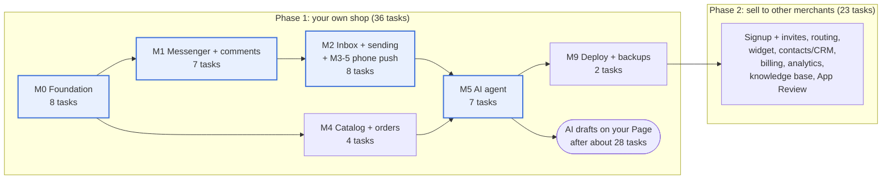

# MVP Build Plan — AI Social Commerce SaaS

Oct 9, 2026 · @PM Dev

## How to use this plan

The work is split into two phases. **Phase 1 (your own shop) is 36 tasks**: Messenger DMs and Page comments, the inbox on your phone, the AI in Draft and Supervised modes, catalog and orders, and a safe deployment. **Phase 2 (selling it to other merchants) is 23 more tasks**: public signup and invites, routing, the website widget, contacts and CRM, billing, analytics, a knowledge base and Meta App Review. Everything is multi-tenant from the first task, so Phase 2 adds features rather than rewriting. Each task is sized for one Claude Code session, with acceptance criteria you can check with tests. The milestone tables below show every task; the Phase 1 scope section lists exactly which ones to build now and what changed after the plan review.

**Running a task in Claude Code**

1. Start a fresh session per task. Paste the task row (ID, goal, files, acceptance criteria) as the prompt, plus: “Read CLAUDE.md and the linked spec section first. Plan, then implement, then run the tests.”
2. Keep the specs in the repo under `docs/specs/` (export the Feature Specs, Architecture and Schema docs as Markdown) so Claude Code can read them.
3. If a task grows past one session, stop, commit what passes, and split the rest into a new task rather than letting the session run on.
4. One task = one branch = one pull request. Merge only when CI is green.

**Definition of done (every task)**

- [ ] Acceptance criteria met, each covered by an automated test where possible
- [ ] `pnpm lint`, `pnpm typecheck` and `pnpm test` pass locally and in CI
- [ ] New tenant tables have RLS and appear in the tenant-isolation test
- [ ] New endpoints have a permission decorator and a cross-tenant test
- [ ] Migrations are forward-only SQL and run cleanly on a fresh database
- [ ] CLAUDE.md or `docs/` updated if a rule or folder changed

**Task IDs** are `M<milestone>-<number>`; the Depends on column lists task IDs that must be merged first. Sizes are S (under 2 hours of review) or M (half a day). Nothing here is L; an L is a sign the task should be split.

The repo's CLAUDE.md, with the architecture rules, folder structure, conventions, testing requirements and never-do list, is delivered as a separate file alongside this doc.

## Milestone map

The critical path runs M0 → M1 → M2 → M5 (highlighted): the AI cannot be tested on real conversations until messages flow in and out. Catalog and orders (M4) depend only on the foundation, so they are good work for days when Meta setup is blocked. You can start using the AI in Draft mode on your own Page after about 28 tasks.

Suggested order for Phase 1: M0, M1-1 to M1-6, M2-1 to M2-7, M4, M5-1 and M5-3 to M5-5 (start using Draft mode here), then M1-7 comments, M3-5 push, M5-6 to M5-8, M4-5, and M9-3 and M9-4 before relying on it daily. No Business Verification or App Review is needed while only you use it; that moves to Phase 2.

## Phase 1 scope (your own shop)

Build these 36 tasks now. Rows marked *changed* were updated after the plan review; read the task row in its milestone table for the full acceptance criteria.

| Milestone | Phase 1 tasks | Changed after review | Phase 2 tasks |
| --- | --- | --- | --- |
| M0 Foundation | M0-1, M0-2, M0-3, M0-4, M0-5, M0-6, M0-8, **M0-9 (new)** | M0-4 transaction-local context only; M0-5 expects 404; M0-6 owner-only login, no public signup, includes the permission guard; M0-8 audit chained by a background job | M0-7 invites and full RBAC UI, public signup |
| M1 Messenger | M1-1 to M1-6, **M1-7 (new)** | M1-2 adds the privacy page, data-deletion endpoint and a no-role test message; M1-5 handles Business Suite echoes | — |
| M2 Inbox | M2-1 to M2-7 | M2-3 XSS-safe rendering; M2-7 adds manual assign and the unassigned queue | M2-8 saved replies and search |
| M3 Routing | M3-5 phone push | — | M3-1 to M3-4 |
| M4 Catalog and orders | M4-1, M4-2, M4-4, M4-5 | M4-1 adds `product_post_links`; M4-2 adds quick-add, post linking and delivery settings (M4-3 merged in); M4-5 adds courier CSV export | CSV product import |
| M5 AI agent | M5-1, M5-3 to M5-8 | M5-3 own-contact scoping, no knowledge search; M5-4 safe debounce; M5-5 price placeholders; M5-6 no discounts, confirm button, product carousel; M5-7 settings page only | M5-2 knowledge base, agent versions and sandbox |
| M6 Widget | — | — | M6-1 to M6-3 |
| M7 Contacts and CRM | — | — | M7-1 to M7-5 |
| M8 Billing | — | — | M8-1 to M8-5 |
| M9 Launch | M9-3, M9-4 | — | M9-1, M9-2 analytics; M9-5 load and pilot checks; Business Verification and App Review |

**Phase 1 is done when:**

- [ ] You handle your real Messenger and comment traffic from the app on your phone for 2 weeks without going back to Business Suite for routine replies
- [ ] The AI's Draft replies are accepted without edits most of the time, with zero invented prices
- [ ] Replies you send from Business Suite always pause the AI for that conversation
- [ ] Orders go from chat to confirmed to delivered without overselling, and export to your courier's bulk upload
- [ ] The isolation suite passes, including system jobs and the `users` table
- [ ] Backups restore to a fresh server, and you know your AI cost per conversation

## M0 — Foundation

**Outcome:** a merchant can sign up, get a workspace with seeded roles, invite a teammate and log in; every later task inherits tenant isolation, permissions, audit and events without extra work. Spec references: Architecture (stack, tenancy, auth/RBAC), Schema (identity, audit, RLS).

| ID | Task | Size | Goal | Files / areas | Depends on | Acceptance criteria |
| --- | --- | --- | --- | --- | --- | --- |
| M0-1 | Monorepo scaffold | S | One TypeScript repo with the agreed layout | root `package.json`, `pnpm-workspace.yaml`, `turbo.json`, `apps/{web,api,worker}`, `packages/{shared,db,config}`, `CLAUDE.md` | — | `pnpm build`, `lint`, `typecheck`, `test` all pass; api and worker expose `/health`; web renders a placeholder page; TS `strict` on everywhere |
| M0-2 | Local infrastructure | S | Run every dependency locally with one command | `infra/docker/compose.dev.yml` (Postgres 16 + pgvector, Redis, MinIO, Mailpit), `.env.example`, `packages/testing` (Testcontainers helpers) | M0-1 | `pnpm infra:up` starts all services healthy; a sample test boots a real Postgres via Testcontainers and runs a query |
| M0-3 | CI pipeline | S | Every PR is checked automatically | `.github/workflows/ci.yml`, Dockerfiles per app | M0-1, M0-2 | PR runs lint, typecheck, unit and integration tests with Postgres and Redis services; a failing test blocks merge; images build |
| M0-4 | Database foundation and RLS | M | Migrations, tenant context and isolation in place | `packages/db/{migrations,schema,client.ts,tenant-db.ts}`, ESLint rule | M0-2 | Identity, audit and outbox tables from the Schema doc migrate on a fresh DB; `tenantDb(ctx)` runs `set_config('app.tenant_id', …, true)` per transaction; lint fails when the raw client is imported outside `packages/db`; a test fails if any table with `tenant_id` lacks forced RLS; lint bans session-level SET app.\* and set\_config outside tenantDb; a test proves a pooled connection carries no tenant context into the next transaction |
| M0-5 | Tenant-isolation test harness | S | Make cross-tenant tests one line to write | `packages/testing/tenancy.ts`, `apps/api/test/isolation/` | M0-4 | Fixture creates tenants A and B; helper calls any endpoint as A with B's IDs and expects 404; template test passes and runs in CI |
| M0-6 | Owner login and sessions | M | Phase 1: you (the Owner) log in to your workspace. Phase 2 adds public signup | `apps/api/src/modules/auth`, `apps/api/src/modules/tenants`, `apps/web/app/(auth)` | M0-4 | A seed command creates your workspace, 6 built-in roles and your Owner account in one transaction (public signup is Phase 2); email + password and Google login; HttpOnly Secure session cookie; login rate-limited; workspace switch rejects non-members; password reset and email verification work; the @RequirePermission guard and CI route check from M0-7 are built here; workspaces come from sys.user\_workspaces and password hashes are read only through the auth role |
| M0-7 | RBAC and team invites | M | Permissions enforced server-side on every route | `packages/shared/permissions.ts`, `apps/api/src/common/guards/permission.guard.ts`, `apps/api/src/modules/rbac`, `scripts/check-route-permissions.ts`, `apps/web/app/settings/members` | M0-6 | Agent gets 403 on an Admin-only endpoint; CI script fails if a route has neither `@RequirePermission` nor `@Public`; `GET /me` returns permissions; invite email arrives in Mailpit and accepting it creates a membership |
| M0-8 | Request context, audit and outbox | M | Every change is attributable and every event is published only after commit | `apps/api/src/common/context`, `apps/api/src/modules/audit`, `packages/db/outbox.ts`, `apps/worker/src/outbox-publisher.ts`, logging setup | M0-4 | Correlation ID appears in logs and audit rows; audit rows are written without a hash in the same transaction and a background job (audit\_chainer role) chains them per tenant; a test detects a tampered row; an event in a rolled-back transaction is never published; a committed one reaches Redis pub/sub within 1 s |

**Added after the plan review:**

| ID | Task | Size | Goal | Files / areas | Depends on | Acceptance criteria |
| --- | --- | --- | --- | --- | --- | --- |
| M0-9 | System access for background jobs | M | Jobs that must look across tenants work without bypassing RLS | migration for `sys` schema, `sys_owner`, `worker_user`, `auth_user`, `outbox_publisher` and `audit_chainer` roles (Schema doc, Roles and RLS); `packages/db/system.ts` | M0-4, M0-8 | Each process connects with exactly one role; worker resolves a Page to its tenant via `sys.resolve_channel_account`; schedulers get `(tenant_id, id)` pairs from `sys.due_work`; outbox publisher reads only `outbox_events`; app role is denied all three functions except `sys.user_workspaces`; all 25 schema tests from the Schema doc run in CI |

## M1 — Messenger ingestion

**Outcome:** a merchant connects a Facebook Page, and every customer message, image and sticker lands in the database exactly once, in order, under the right tenant. Spec references: Feature Specs Module 2 (pipeline, constraints), Architecture (messaging pipeline), Schema (channels, contacts, messages).

| ID | Task | Size | Goal | Files / areas | Depends on | Acceptance criteria |
| --- | --- | --- | --- | --- | --- | --- |
| M1-1 | Channel model and adapter interface | M | Channels are pluggable and tokens are safe | `packages/channels/{adapter.ts,types.ts}`, migrations for `channels`, `channel_accounts`, `channel_credentials`, `packages/shared/crypto.ts` | M0-4 | `ChannelAdapter` interface matches the Architecture doc; tokens encrypt/decrypt with a versioned key from env; a log-capture test proves no token appears in logs or error output |
| M1-2 | Connect a Facebook Page | M | Admin connects one or more Pages from the app | `apps/api/src/modules/channels/meta-oauth.*`, `apps/web/app/settings/channels` | M1-1, M0-6 | With a Meta dev app and test Page: OAuth completes, long-lived token stored, required scopes verified, webhook fields subscribed; same Page in a second workspace returns 409; disconnect unsubscribes and sets status; a privacy policy page and a data-deletion endpoint exist (Meta requires them to go Live); a message from an account with no role on the Meta app reaches the inbox — if not, switch the app to Live |
| M1-3 | Webhook receiver | M | Accept Meta events fast and never lose one | `apps/api/src/webhooks/meta.controller.ts` (own entrypoint), migration for `webhook_events`, `apps/worker/src/sweeper.ts` | M1-1 | GET handshake echoes `hub.challenge`; bad `X-Hub-Signature-256` returns 403; same event twice stores one row; p95 response under 200 ms in an integration test; with Redis stopped, events are stored and enqueued by the sweeper once Redis returns |
| M1-4 | Messenger adapter: parse and normalize | S | Turn Messenger payloads into internal events | `packages/channels/messenger/{parse.ts,normalize.ts}`, `packages/channels/messenger/fixtures/*.json` | M1-1 | Contract tests over recorded fixtures for text, image, sticker, postback, echo, delivery and read events; unknown types become `unsupported` without throwing |
| M1-5 | Inbound processing worker | M | Store contacts, conversations and messages correctly | `apps/worker/src/inbound/`, migrations for `contacts`, `contact_identities`, `conversations`, `messages` (partitioned), `message_keys`, `apps/worker/src/partitions.ts` | M1-3, M1-4, M0-8 | Replaying a webhook stores one message; 20 concurrent messages in one conversation get `seq` 1–20 with no gaps; a message for an unknown Page is quarantined, never assigned to a tenant; resolved conversations reopen per the 30-day rule; next 3 monthly partitions are created by a job; isolation tests cover all new tables; Page lookup uses sys.resolve\_channel\_account; an echo sent from Meta Business Suite is stored as a human reply, makes the conversation human-owned and pauses AI for 2 hours, while echoes of our own sends are not duplicated; an alert fires if messages\_default has any rows |
| M1-6 | Media download and storage | S | Customer images and files are kept before provider URLs expire | `apps/worker/src/media/`, migration for `attachments`, `packages/storage/` (S3 client, presign) | M1-5 | Inbound image is downloaded to `tenants/{id}/…`, thumbnail created, MIME and size checked; presigned GET expires in 15 min; a URL for tenant A's file is refused when requested by tenant B |

**Added after the plan review:**

| ID | Task | Size | Goal | Files / areas | Depends on | Acceptance criteria |
| --- | --- | --- | --- | --- | --- | --- |
| M1-7 | Comments to DM | M | Turn “price?” comments on your posts into Messenger conversations | feed webhook subscription, `packages/channels/messenger/comments.ts`, comment items in the inbox, private-reply send path | M1-5, M2-5 | Comments appear in the inbox linked to their post (and product, when mapped); one private reply per comment, allowed only within 7 days of the comment, enforced by `SendEligibilityService`; a second attempt or an older comment shows why it is blocked; when the customer answers, the conversation continues as a normal DM with the post ID stored; recorded comment fixtures in contract tests |

**Side task (not code):** create your Meta developer app and connect your own Page. App Review and Business Verification are Phase 2; they are not needed while only you use the app.

## M2 — Inbox, realtime and sending

**Outcome:** an agent sees new Messenger conversations appear live, reads the thread, replies with text or images within Meta's window rules, and sees sent/delivered/read status. Spec references: Feature Specs Module 1 (Unified Inbox) and Module 2 (send rules), Architecture (real-time, ordering, dedup).

| ID | Task | Size | Goal | Files / areas | Depends on | Acceptance criteria |
| --- | --- | --- | --- | --- | --- | --- |
| M2-1 | Realtime gateway | M | Push committed events to the right browsers | `apps/api/src/realtime/` (own entrypoint), Redis adapter, `apps/web/lib/socket.ts` | M0-8, M1-5 | Socket handshake uses the session cookie; a client in tenant A never receives tenant B's events (test); event reaches the browser within 1 s of commit; after reconnect, the client fetches missed items by cursor and shows no duplicates |
| M2-2 | Conversation list | M | Agents see and filter their inbox | `apps/api/src/modules/inbox/conversations.*`, migration `conversation_reads`, `apps/web/app/inbox/(list)` | M2-1 | Cursor-paginated list sorted by last message; filters for status, owner, team, channel, unread combine correctly; unread badge is per user; new conversation appears live without refresh |
| M2-3 | Thread view | M | Read full history with media and statuses | `apps/api/src/modules/inbox/messages.*`, `apps/web/app/inbox/[id]` | M2-2, M1-6 | Loads latest 50 then pages older by `seq`; images and stickers render from presigned URLs; unsupported types show a placeholder; contact name and channel shown in the side panel; late older messages render in the right place; customer text and file names render as plain text (XSS fixture in the E2E test); media loads from the separate media domain |
| M2-4 | Send eligibility service | S | One place decides what may be sent | `apps/api/src/modules/channels/send-eligibility.ts`, `GET /conversations/:id/send-eligibility` | M1-5 | Table-driven unit tests cover: inside 24 h (any sender), 24 h–7 d (human only, HUMAN\_AGENT tag), after 7 d (blocked), AI sender after 24 h (blocked), disconnected channel (blocked); composer shows the window countdown |
| M2-5 | Outbound send pipeline | M | Replies reach Messenger reliably, once, in order | `POST /conversations/:id/messages`, `apps/worker/src/outbound/`, `packages/channels/messenger/send.ts`, status handling in inbound worker | M2-4 | Same `Idempotency-Key` twice creates one message; two quick replies arrive in order; token error marks the message failed and the channel needs-attention; retryable errors back off; a late “delivered” after “read” is ignored; retry endpoint resends a failed message once |
| M2-6 | Composer | M | Agents write and send comfortably on desktop and phone | `apps/web/components/composer/`, presigned PUT upload endpoint | M2-5 | Playwright: send text, emoji and an image; message shows pending → sent → delivered; when offline, the send waits and goes out once on reconnect; files over the channel limit are rejected before upload |
| M2-7 | Conversation actions and notes | M | Resolve, snooze, tag, note, take over, assign | migrations `tags`, `conversation_tags`, `conversation_notes`, `conversation_assignments`; `apps/api/src/modules/inbox/actions.*`; header UI | M2-3 | Resolve, snooze (wakes at time), reopen work and are audited; notes are stored separately and a test proves no code path enqueues a note for sending; take over sets owner and emits an event other viewers see live; a non-owner agent's composer is locked; manual assign to a teammate and an unassigned queue work (this replaces the M3-2 engine in Phase 1) |
| M2-8 | Saved replies and search | S | Faster replies and finding past chats | migration `canned_replies`, `apps/api/src/modules/inbox/{saved-replies,search}.*`, composer `/` menu | M2-6 | `/` lists shared and personal replies; variables fill from the contact; duplicate shortcut rejected; search over names, phone and message text returns only the tenant's data; p95 under 300 ms on 100k seeded messages |

## M3 — Teams and routing (Phase 1: M3-5 only)

**Outcome:** conversations that need a human go to the right team and an available agent, agents get a push notification on their phone, and Supervisors see who is overloaded. Rule-based routing is v1; MVP is manual plus round-robin. Spec reference: Feature Specs Module 3.

| ID | Task | Size | Goal | Files / areas | Depends on | Acceptance criteria |
| --- | --- | --- | --- | --- | --- | --- |
| M3-1 | Teams management | S | Admins create teams and set capacity and hours | `apps/api/src/modules/routing/teams.*`, `apps/web/app/settings/teams` | M0-7 | CRUD for teams and members; capacity must be positive; business hours stored in tenant timezone; only members of the workspace can be added (FK test) |
| M3-2 | Assignment engine | M | Assign fairly without double-assigning | `apps/api/src/modules/routing/assignment.service.ts`, `apps/worker/src/routing/` | M3-1, M2-7 | Round-robin skips offline and at-capacity agents; 50 parallel assignment requests never give one conversation two owners; manual assign and transfer write `conversation_assignments` with reason; sticky return to last agent within 7 days when available |
| M3-3 | Agent presence and queue | S | Know who is available; nothing gets stuck | `apps/api/src/modules/routing/presence.*`, Redis presence keys, queue view UI | M3-2 | Online/Away/Offline toggle; auto-Away after 10 min idle; an offline agent's conversations return to the queue after 30 min; unassigned queue shows wait time per conversation |
| M3-4 | First-response SLA | S | Flag slow responses inside business hours | `apps/worker/src/scheduled/sla.ts`, `conversations.sla_due_at` logic | M3-2 | SLA clock pauses outside business hours (test across a Friday evening); breach sets a flag and emits `inbox.sla.breached`; first public reply by AI or human stops the clock |
| M3-5 | Notifications and Web Push | M | Agents hear about work on their phone | `apps/api/src/modules/notifications/`, `apps/web/public/sw.js`, PWA manifest, VAPID keys | M2-7 | Notification center lists assignments, handoffs and SLA breaches; Web Push arrives on Android Chrome when the app is closed; users can mute per type; no push is sent to a user with an active socket on that conversation |

## M4 — Catalog and orders (minimal)

**Outcome:** the merchant's products, prices, stock and delivery fees live in the system, and an order can be drafted from a conversation and confirmed without ever overselling. This is the source of truth the AI's tools read. Courier API booking is post-MVP; the MVP stores a tracking number entered by hand. The commerce tables are not in the Schema doc yet, so M4-1 designs them.

| ID | Task | Size | Goal | Files / areas | Depends on | Acceptance criteria |
| --- | --- | --- | --- | --- | --- | --- |
| M4-1 | Commerce schema | M | Tables for products, stock, delivery and orders | `docs/specs/schema-commerce.md`, migrations for `products`, `product_variants`, `product_images`, `delivery_zones`, `orders`, `order_items`, `order_status_history`, product\_post\_links | M0-4 | Follows the Schema doc conventions (composite FKs, RLS, minor units); `stock_on_hand >= 0` check; order number unique per tenant; isolation tests cover every table; product\_post\_links maps a Facebook post or ad ID to a product |
| M4-2 | Catalog management | M | Merchants add products with variants, prices, stock and photos | `apps/api/src/modules/catalog/`, `apps/web/app/catalog`, CSV import job | M4-1, M1-6 | Product with size/colour variants saved; images upload via presigned PUT; quick-add from the phone (photo, name, price, sizes) takes under a minute per product; posts and ads can be linked to products; delivery zones, fees and payment methods are set here (M4-3 merged in); CSV import is Phase 2; search matches Bangla and Banglish aliases (“panjabi” finds “পাঞ্জাবি”) via a stored alias field |
| M4-3 | Delivery and payment settings | S | Merged into M4-2 for Phase 1 | `apps/api/src/modules/catalog/delivery.*`, settings UI | M4-1 | Zones (for example Inside Dhaka, Outside Dhaka) with fee and estimated days; payment methods COD and advance delivery fee; `getDeliveryFee(zone)` used by the order service, never hard-coded |
| M4-4 | Order drafts and confirmation | M | Create orders from chat without overselling | `apps/api/src/modules/orders/{draft,confirm}.service.ts` | M4-2 | Server computes every total; drafts are versioned; confirming a stale version is rejected; two concurrent confirms for the last unit → exactly one succeeds; confirming the same draft version twice creates one order; stock and status change in one transaction with an outbox event |
| M4-5 | Orders UI and lifecycle | M | Order managers process orders | `apps/web/app/orders`, inbox side-panel “Create order”, `apps/api/src/modules/orders/status.*` | M4-4, M2-3 | Allowed transitions only (confirmed → packed → shipped → delivered / returned; cancel before shipping restores stock); each change in `order_status_history` and audit; tracking number field; contact delivered/returned counts update; CSV export in your courier's bulk-upload format and CSV import of tracking numbers |

## M5 — AI sales agent

**Outcome:** the AI drafts replies in Bangla, English and Banglish from live catalog data; in Supervised mode it sends low-risk answers itself, builds order drafts, and hands off to a human with a summary when it should. Automatic mode is unlocked per tenant after the pilot. Spec reference: Feature Specs Module 4.

| ID | Task | Size | Goal | Files / areas | Depends on | Acceptance criteria |
| --- | --- | --- | --- | --- | --- | --- |
| M5-1 | AI foundation | M | One safe, metered way to call models | migrations `ai_agents`, `ai_agent_versions`, `ai_runs`; `packages/ai/client.ts` (Anthropic SDK wrapper), `packages/ai/testing/mock-client.ts` | M0-8 | Model names come from agent version config; every call records tokens, cost and latency in `ai_runs`; per-tenant budget checked before each call; tests use the mock client and CI fails if an API key is present in the test env |
| M5-2 | Knowledge base and retrieval | M | Policies and FAQs the AI can cite | migrations `knowledge_documents`, `knowledge_chunks` (pgvector); `apps/worker/src/embeddings/`; `packages/ai/retrieval.ts`; KB settings UI | M5-1 | Upload text/FAQ → chunked and embedded by a job; hybrid search (vector + trigram) filtered by tenant; tenant B's chunks never returned for A (test); a 50-question Banglish set reports recall@5 for the chosen embedding model |
| M5-3 | AI tools | M | Typed tools that are the only source of facts | `packages/ai/tools/*.ts` (search\_products, get\_variant\_stock, get\_delivery\_fee, search\_knowledge, get\_contact\_orders, create\_order\_draft, update\_order\_draft, request\_handoff) | M4-4 | Each tool has a Zod input schema and unit tests; tenant and conversation are injected from server context, and a `tenant_id` passed in arguments is ignored (test); tools return only active, tenant-owned data; order and tracking tools only see the conversation's own contact, and phone numbers typed in the chat are ignored; in Phase 1, policies come from the agent settings text and search\_knowledge is not built |
| M5-4 | Reply orchestrator (Draft mode) | M | Generate one good draft per customer burst | `apps/worker/src/ai/reply.job.ts`, `packages/ai/orchestrator.ts`, `packages/ai/prompts/` | M5-3, M2-7 | 5 messages within 8 s produce one run; Haiku classifies language, intent and risk; Sonnet runs the tool loop; draft appears in the composer marked as AI; if a human takes over during generation the output is discarded (test); debounce uses BullMQ deduplication rather than a reused job ID, tested with two bursts a minute apart; an echo from Business Suite cancels the pending run |
| M5-5 | Reply validator | S | Block invented prices, stock, promises and links | `packages/ai/validator.ts` | M5-4 | Unit tests: prices and totals appear only as placeholders such as {{price:variant\_id}}, filled by the server from this run's tool results; a raw currency amount, including Bangla digits, is blocked; any discount offer is blocked; non-allowlisted links are blocked; instructions inside customer text are not followed (injection fixtures) |
| M5-6 | Supervised mode, order drafts and handoff | M | AI sends safe answers and passes the rest to humans | `packages/ai/policy.ts`, handoff service, holding-message templates | M5-5, M2-7 | Allowlisted intents (greeting, price, availability, delivery fee) send via the outbound pipeline as sender `ai`; complaints, refunds, bargaining and abuse hand off to the unassigned queue with an AI summary note; AI never sends after 24 h; order confirmation uses a Confirm order quick-reply button or a clear yes (unclear replies get the question again); an unknown product gets a product carousel, and a mapped post or ad pre-selects its product |
| M5-7 | Agent settings, versions and sandbox | M | Phase 1: a settings page only (persona, tone, mode, intent allowlist, budget, policy text). Versions, sandbox and rollback are Phase 2 | `apps/web/app/ai`, `apps/api/src/modules/ai/{settings,versions,sandbox}.*` | M5-6 | Persona, tone, mode, intent allowlist and budget editable; sandbox chat shows tool calls and validator results; publishing requires a passing test report and creates an immutable version; rollback restores a previous version |
| M5-8 | Evaluation suite and safeguards | M | Know the AI is good before merchants rely on it | `packages/ai/evals/` (40+ Bangla/Banglish/English scenarios), nightly CI job, budget alerts, provider-failure fallback | M5-7 | Evals cover price, stock, out-of-stock alternatives, delivery fee, order draft, injection and handoff; nightly run posts a pass rate and cost; 80% and 100% budget alerts fire; on provider errors the tenant falls back to Draft mode and pending conversations hand off |

## M6 — Website widget (Phase 2)

**Outcome:** merchants with a website paste one snippet and get a chat bubble that feeds the same inbox and AI. It is also the channel Meta cannot switch off, and the easiest way to test the whole system without a Meta app. Spec reference: Feature Specs Module 2 (Flow 2.4).

| ID | Task | Size | Goal | Files / areas | Depends on | Acceptance criteria |
| --- | --- | --- | --- | --- | --- | --- |
| M6-1 | Webchat adapter and visitor sockets | M | The widget is just another channel | `packages/channels/webchat/`, `apps/api/src/realtime/visitor.namespace.ts`, widget config API, migration for `widget_configs` | M2-5 | Visitor tokens are signed and scoped to one site; connections from non-allowed domains are refused; visitor messages flow through the same inbound pipeline and appear in the inbox; per-IP rate limits apply |
| M6-2 | Widget client | M | A small, fast, embeddable chat bubble | `apps/widget/` (Preact or vanilla TS), install snippet page in settings | M6-1 | Bundle under 50 KB gzipped; renders without breaking host page styles (shadow DOM); pre-chat fields, greeting and colours from config; survives reconnects; Playwright test on a sample host page |
| M6-3 | Visitor phone verification | S | Link a website visitor to a known customer | `apps/api/src/modules/contacts/otp.*`, SMS gateway client, widget OTP step, migration contact\_phones | M6-2 | OTP sent through the BD SMS gateway, expires in 5 min, max 3 attempts; verified phone stored with `verified_by = 'otp'`; resend rate-limited per phone and IP |

## M7 — Contacts and CRM (Phase 2)

**Outcome:** each customer has one profile with their channels, phones, addresses, orders and delivery history; duplicates across channels are suggested and merged safely, and customer data requests can be honoured. Spec reference: Feature Specs Module 6; Schema doc (contacts and merging).

| ID | Task | Size | Goal | Files / areas | Depends on | Acceptance criteria |
| --- | --- | --- | --- | --- | --- | --- |
| M7-1 | Contact profile | M | See and edit everything about a customer | migrations `contact_``addresses`, `contact_tags`, `contact_notes`; `apps/api/src/modules/contacts/`; `apps/web/app/contacts` and inbox side panel | M2-3, M4-5 | List with search and filters; profile shows identities, phones, addresses, tags, notes, order count, value and delivery success as “4/5”; phones normalised to E.164 and invalid BD numbers rejected; edits audited |
| M7-2 | Customer timeline | S | One chronological view of a customer | `GET /contacts/:id/timeline`, timeline component | M7-1 | Merges messages, orders, status changes and notes across all channels by time with cursor paging; respects the viewer's permissions (agents see only allowed conversations) |
| M7-3 | Merge suggestions | S | Find the same person across channels | migration `merge_suggestions`, `apps/worker/src/contacts/suggest.ts` | M7-1, M6-3 | A verified phone matching another contact creates one suggestion per pair with evidence; dismissed pairs are not suggested again; WhatsApp-ID auto-merge setting is respected (off by default) |
| M7-4 | Merge and undo | M | Merge safely and reversibly | migration `contact_merges`, `apps/api/src/modules/contacts/merge.service.ts`, side-by-side merge UI | M7-3 | One transaction re-points identities, conversations, phones, addresses, tags and notes; duplicates are recorded as dropped; secondary becomes a stub; undo within 7 days restores exactly what moved (round-trip test); counters recomputed; audited |
| M7-5 | Consent, export and deletion | M | Opt-outs and customer data requests | migration `marketing_consents`; STOP / “bondho koro” detection; export and anonymise jobs | M7-1 | Opt-out keywords record consent per channel with evidence message; export produces a file of profile, messages and orders; anonymise removes personal fields, messages and media while keeping order financial rows; both audited and Owner/Admin only |

## M8 — Billing (Phase 2)

**Outcome:** new workspaces start a 14-day trial, Owners pay in BDT through one local gateway, limits are enforced from the plan, and unpaid workspaces move through grace, restricted and suspended without losing data. Pick the gateway before M8-2 (open question in the Feature Specs). Spec reference: Feature Specs Module 8; Schema doc (billing).

| ID | Task | Size | Goal | Files / areas | Depends on | Acceptance criteria |
| --- | --- | --- | --- | --- | --- | --- |
| M8-1 | Plans, trial and entitlements | M | Every workspace has a plan and computed limits | migrations `plans`, `subscriptions`, `invoices`, `payments`, `usage_events`, `usage_counters`; plan seed; `apps/api/src/modules/billing/entitlements.service.ts` | M0-6 | Signup starts a trial subscription; at most one live subscription per tenant (DB-enforced); `GET /entitlements` returns limits from the plan, cached and refreshed on billing events |
| M8-2 | Checkout and payment confirmation | M | Take a payment and activate only on verified proof | `apps/api/src/modules/billing/{checkout,gateway}.*`, `POST /webhooks/payments/:gateway`, confirmation page | M8-1 | Return URL never activates anything; gateway webhook plus server-side validation marks the invoice paid; the same transaction ID twice settles once; a pending-payment job re-checks unconfirmed payments every minute for 24 h; tested with the gateway sandbox |
| M8-3 | Limits and usage metering | S | Plans actually limit seats, channels and AI | usage recorder, limit checks in invites, channel connect and AI orchestrator; nightly reconcile job | M8-1, M5-1 | Inviting past the seat limit and connecting past the channel limit are refused with a clear message; AI conversations counted once per conversation per day via idempotency key; at 100% AI switches to Draft mode; nightly reconcile fixes counter drift |
| M8-4 | Renewal and dunning | M | Unpaid workspaces degrade gracefully | `apps/worker/src/scheduled/billing.ts`, restricted-mode guard | M8-2 | Renewal invoice and reminders at 7 and 3 days; past due → restricted on day 8 (inbox read-only, AI and sending off, data exportable) → suspended on day 30; a payment at any stage restores access immediately; time-travel tests cover each step |
| M8-5 | Billing UI, plan changes and invoices | S | Owners manage their plan themselves | `apps/web/app/settings/billing`, invoice PDF generation | M8-3, M8-4 | Upgrade applies now with prorated charge; downgrade scheduled for renewal with over-limit choices; cancel at period end; invoice PDF with sequential number and VAT line; only Owner (or Admin with billing permission) can act |

## M9 — Analytics and launch readiness (Phase 1: M9-3 and M9-4)

**Outcome:** Owners see sales, response times and AI performance with clear definitions, and the system runs in production with backups, monitoring and a tested restore, ready for pilot merchants. Spec references: Feature Specs Module 7; Architecture (hosting, scaling, risks).

| ID | Task | Size | Goal | Files / areas | Depends on | Acceptance criteria |
| --- | --- | --- | --- | --- | --- | --- |
| M9-1 | Analytics aggregation | M | Fast, correct daily metrics per tenant | migration `metric_daily`; `apps/worker/src/analytics/` consuming outbox events; nightly rebuild job | M4-5, M5-6, M3-4 | Metrics match the definitions table in the Feature Specs (tests with fixed fixtures); days bucketed in tenant timezone; late cancellations update the original day; today refreshes every 5 min |
| M9-2 | Dashboards | M | Overview, Conversations and AI pages | `apps/api/src/modules/analytics/`, `apps/web/app/analytics` | M9-1 | KPI cards with change vs previous period; every KPI shows its definition; small samples shown as counts (“2/3”); “data as of” time shown; agents see only their own stats; CSV export |
| M9-3 | Production deployment | M | Ship to the BD VPS safely | `infra/docker/compose.prod.yml`, `infra/caddy/Caddyfile`, deploy workflow, secrets (SOPS), Cloudflare config notes | M0-3 | Staging and production on separate servers; origin accepts only Cloudflare IPs; deploy restarts one process at a time so webhooks keep flowing (test by replaying events during a deploy); rollback to previous image in one command |
| M9-4 | Backups, monitoring and alerts | M | Know when something breaks and recover from it | pgBackRest config, MinIO replication, Grafana/Prometheus/Loki, Sentry, alert rules, `docs/runbooks/` | M9-3 | WAL archived off-site; a timed restore drill to a fresh server is documented and under 4 hours; alerts to phone for API errors, queue lag over 30 s, webhook silence per channel, disk over 80%, backup failure |
| M9-5 | Load, security and pilot checks | M | Prove it holds up before real merchants | `tests/load/` (replay recorded webhooks), full isolation suite, dependency and secret scanning, pilot onboarding checklist | M9-4, M8-5, M6-2, M7-5 | 2× the 10-merchant burst replayed with no lost or duplicated messages; every API route covered by a cross-tenant test; no high-severity dependency findings; Meta App Review approved; onboarding a new merchant takes under 30 min with the checklist |

## Phase 2 exit criteria (selling to other merchants)

The MVP is ready for paying pilot merchants when every box below is ticked.

- [ ] A new merchant signs up, connects a Facebook Page and the website widget, and imports products in under 30 minutes
- [ ] Customer messages appear in the inbox within 2 seconds, once, in order
- [ ] The AI drafts correct replies in Bangla, English and Banglish; the eval suite passes at the agreed rate with zero invented prices
- [ ] Supervised mode sends only allowlisted intents and hands off everything else with a summary
- [ ] An order can go from chat to confirmed to delivered without overselling
- [ ] Human takeover always stops the AI, including mid-generation
- [ ] Cross-tenant tests cover every route, socket event and AI tool, and all pass
- [ ] Billing collects a real BDT payment and enforces plan limits
- [ ] Backups restore successfully to a fresh server within 4 hours
- [ ] Meta App Review is approved for the permissions in use

**Deliberately left out of the MVP:** Instagram, WhatsApp, broadcasts, courier API booking, image-based product matching, Automatic AI mode, custom roles, rule-based routing and scheduled reports. Each becomes a v1 milestone using the same task format.
