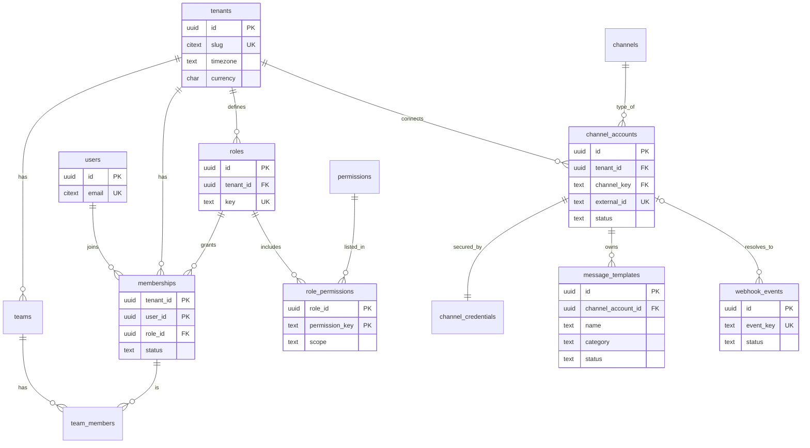
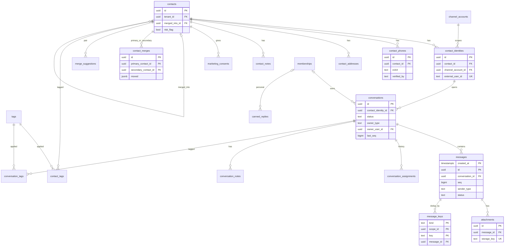
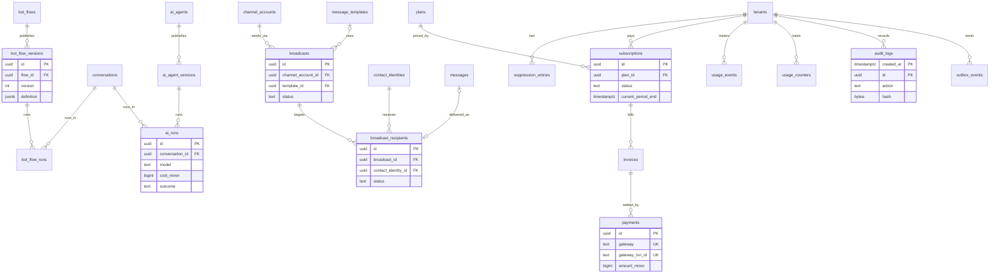

# Database Schema — AI Social Commerce SaaS

Oct 9, 2026 · @PM Dev

## Key design decisions

**One shared PostgreSQL schema, 48 tables in 8 domains plus one credentials table in a locked auth schema, with tenant isolation enforced by the database itself.** The full DDL below was run and tested on PostgreSQL 16, including a cross-tenant leak test.

1. **Tenant isolation in three layers.** Every tenant-owned table has `tenant_id`; every foreign key between tenant tables is composite `(tenant_id, id)`, so a row can never point at another tenant's row; and Row-Level Security filters every query by `current_setting('app.tenant_id')`. A bug in one layer is caught by the next.
2. **Contacts vs identities.** A *contact* is the real person; a *contact\_identity* is one channel account of theirs (Messenger PSID, Instagram IGSID, WhatsApp number, widget visitor). Conversations attach to identities, so merging two contacts only re-points identities and never rewrites message history.
3. **Merging is reversible.** A merged contact is kept as a stub with `merged_into_id`; `contact_merges` records exactly which rows moved, so an undo within 7 days is precise. Duplicates are found through `contact_phones`, with a partial unique index on verified phones.
4. **Channels are data, not code paths.** `channels` is a small global catalog (messenger, instagram, whatsapp, webchat); `channel_accounts` holds each merchant's connected Page, account or number. A new channel means a new catalog row and adapter, no schema change.
5. **Messages are partitioned by month.** It is the only table that reaches hundreds of millions of rows. The primary key includes `created_at` (a PostgreSQL rule for partitioned tables); dedupe uses a separate small `message_dedup` table, because a unique index on a partitioned table must include the partition key.
6. **One owner, many assignments.** `conversations.owner_type` + `owner_user_id` is the current owner (AI or a human), read on every inbox load; `conversation_assignments` is the history used for analytics and audits.
7. **Notes are not messages.** Internal notes live in `conversation_notes`, so no send path can ever deliver one to a customer by accident.
8. **Versioned automation.** Bot flows and AI agents publish immutable versions; live conversations reference the exact version that answered them.
9. **Money as integers.** All amounts are `bigint` minor units (poisha) plus a `currency` column. Payments are unique per gateway transaction ID.
10. **Append-only history.** `audit_logs` is insert-only for the app role and hash-chained per tenant by a background job; `outbox_events` is written in the same transaction as each change and published by a worker.
11. **IDs.** UUIDs everywhere (generate UUIDv7 in the application for index-friendly ordering); provider IDs live in their own columns with per-tenant unique indexes.

12) **Nothing bypasses RLS by accident.** Background jobs that must look across tenants (resolving a Page to its tenant, finding due work, publishing events) use their own database roles or three narrow `sys` functions that return only IDs. Password hashes and 2FA secrets live in a separate `auth` schema that the app role cannot read, and `users` has its own policy.

Scope: this covers the modules you listed plus what they depend on (consent for broadcasts, AI runs for bot flows). Products, orders, inventory and couriers are a separate schema doc.

## ERD

The ERD is split into three domain diagrams so each stays readable at page width; a table that appears in two diagrams (for example `conversations`) is the same table. Key columns only; full columns are in the DDL sections below.

**1. Access and channels**



**2. Contacts and conversations (the core)**



**3. Automation, broadcasts, billing and audit**



Every relationship between tenant tables is a composite `(tenant_id, …)` foreign key; `channels`, `permissions`, `plans` and `users` are global.

## Conventions

Every DDL block below runs in order on PostgreSQL 16+ and was tested as written. The same rules apply to every table.

| Rule | Applied as |
| --- | --- |
| Primary keys | `uuid` (`gen_random_uuid()` default; the app supplies UUIDv7) |
| Tenant scoping | `tenant_id uuid NOT NULL` + `UNIQUE (tenant_id, id)` on every tenant table |
| Relationships | Composite foreign keys `(tenant_id, x_id) → (tenant_id, id)` |
| Status fields | `text` + `CHECK (... IN (...))` instead of Postgres enums, so adding a value is a simple migration |
| Money | `bigint` minor units + `char(3)` currency |
| Time | `timestamptz`; `created_at` and `updated_at` (trigger-maintained) |
| Soft delete | `deleted_at` / `archived_at` where users expect undo; hard delete for data-deletion requests |
| Flexible data | `jsonb` only for provider payloads, settings and definitions, never for fields you filter on often |
| Big tables | `messages` and `audit_logs` range-partitioned by month |
| Index naming | `<table>_<purpose>_idx`, partial indexes for queues (`WHERE status = ...`) |

```sql
-- Extensions and shared helpers
CREATE EXTENSION IF NOT EXISTS pgcrypto;   -- gen_random_uuid()
CREATE EXTENSION IF NOT EXISTS citext;     -- case-insensitive email, tag names
CREATE EXTENSION IF NOT EXISTS pg_trgm;    -- fuzzy search for Bangla / Banglish
CREATE EXTENSION IF NOT EXISTS btree_gin;  -- tenant-leading GIN indexes for search

-- Current tenant from the transaction (SET LOCAL app.tenant_id = '...').
-- Returns NULL when unset, so RLS policies match no rows instead of erroring.
CREATE FUNCTION app_tenant_id() RETURNS uuid
LANGUAGE sql STABLE AS $$
  SELECT nullif(current_setting('app.tenant_id', true), '')::uuid
$$;

-- Current user from the transaction (SET LOCAL app.user_id = '...'), used by the users policy.
CREATE FUNCTION app_user_id() RETURNS uuid
LANGUAGE sql STABLE AS $$
  SELECT nullif(current_setting('app.user_id', true), '')::uuid
$$;

CREATE FUNCTION set_updated_at() RETURNS trigger
LANGUAGE plpgsql AS $$
BEGIN NEW.updated_at := now(); RETURN NEW; END $$;
```

The application opens each request's transaction with `SELECT set_config('app.tenant_id', $1, true)`; the RLS section at the end turns policies on for every tenant table at once.

## Identity and access

A user is global and joins workspaces through `memberships`, which carry exactly one role; roles are per tenant so merchants can create custom roles later without affecting others.

| Table | Purpose | Key constraints |
| --- | --- | --- |
| tenants | One merchant workspace | `slug` unique |
| users | Login identity, shared across workspaces; visible only to yourself and members of the current tenant. Password hashes and 2FA secrets are in auth.user\_credentials, readable only by the auth module's role | `email` unique (case-insensitive) |
| permissions | Global list of permission keys | PK `key` |
| roles | Built-in and custom roles per tenant | `(tenant_id, key)` unique |
| role\_permissions | Which permissions a role has, with `own` / `team` / `all` scope | PK `(tenant_id, role_id, permission_key)` |
| memberships | User ↔ tenant link with role and status | PK `(tenant_id, user_id)` |
| teams | Routing groups with method, capacity, SLA, hours | `(tenant_id, name)` unique |
| team\_members | Agents in teams, optional capacity override | FK to `memberships`, so only members can join a team |

```sql
CREATE TABLE tenants (
  id            uuid PRIMARY KEY DEFAULT gen_random_uuid(),
  name          text NOT NULL,
  slug          citext NOT NULL UNIQUE,
  timezone      text NOT NULL DEFAULT 'Asia/Dhaka',
  currency      char(3) NOT NULL DEFAULT 'BDT',
  status        text NOT NULL DEFAULT 'active'
                CHECK (status IN ('active','restricted','suspended','deleted')),
  settings      jsonb NOT NULL DEFAULT '{}',
  created_at    timestamptz NOT NULL DEFAULT now(),
  updated_at    timestamptz NOT NULL DEFAULT now(),
  deleted_at    timestamptz
);

-- Global: one login can belong to many workspaces.
CREATE TABLE users (
  id                uuid PRIMARY KEY DEFAULT gen_random_uuid(),
  email             citext NOT NULL UNIQUE,
  name              text NOT NULL,
  phone_e164        text,
  locale            text NOT NULL DEFAULT 'bn',
  email_verified_at timestamptz,
  last_login_at     timestamptz,
  created_at        timestamptz NOT NULL DEFAULT now(),
  updated_at        timestamptz NOT NULL DEFAULT now()
);

-- Secrets live in a separate schema that only the auth module's database role can read.
CREATE SCHEMA auth;
CREATE TABLE auth.user_credentials (
  user_id                 uuid PRIMARY KEY REFERENCES public.users(id) ON DELETE CASCADE,
  password_hash           text,                  -- Argon2id; NULL for Google-only logins
  totp_secret_encrypted   bytea,                 -- NULL when 2FA is off
  failed_attempts         int NOT NULL DEFAULT 0,
  locked_until            timestamptz,
  password_changed_at     timestamptz,
  updated_at              timestamptz NOT NULL DEFAULT now()
);

-- Global catalog of permission keys, e.g. 'conversations.reply'.
CREATE TABLE permissions (
  key          text PRIMARY KEY,
  module       text NOT NULL,
  description  text NOT NULL
);

CREATE TABLE roles (
  id          uuid PRIMARY KEY DEFAULT gen_random_uuid(),
  tenant_id   uuid NOT NULL REFERENCES tenants(id) ON DELETE CASCADE,
  key         text NOT NULL,                 -- owner, admin, supervisor, agent, order_manager, analyst, custom_*
  name        text NOT NULL,
  is_system   boolean NOT NULL DEFAULT false, -- built-in roles cannot be deleted
  created_at  timestamptz NOT NULL DEFAULT now(),
  updated_at  timestamptz NOT NULL DEFAULT now(),
  UNIQUE (tenant_id, key),
  UNIQUE (tenant_id, id)
);

CREATE TABLE role_permissions (
  tenant_id       uuid NOT NULL,
  role_id         uuid NOT NULL,
  permission_key  text NOT NULL REFERENCES permissions(key),
  scope           text NOT NULL DEFAULT 'all' CHECK (scope IN ('own','team','all')),
  PRIMARY KEY (tenant_id, role_id, permission_key),
  FOREIGN KEY (tenant_id, role_id) REFERENCES roles (tenant_id, id) ON DELETE CASCADE
);

-- A user's membership in one workspace, with exactly one role.
CREATE TABLE memberships (
  tenant_id   uuid NOT NULL REFERENCES tenants(id) ON DELETE CASCADE,
  user_id     uuid NOT NULL REFERENCES users(id) ON DELETE CASCADE,
  role_id     uuid NOT NULL,
  status      text NOT NULL DEFAULT 'active' CHECK (status IN ('invited','active','deactivated')),
  invited_by  uuid REFERENCES users(id),
  joined_at   timestamptz,
  created_at  timestamptz NOT NULL DEFAULT now(),
  updated_at  timestamptz NOT NULL DEFAULT now(),
  PRIMARY KEY (tenant_id, user_id),
  FOREIGN KEY (tenant_id, role_id) REFERENCES roles (tenant_id, id)
);
CREATE INDEX memberships_user_idx ON memberships (user_id);
-- Exactly one Owner per workspace is enforced in the service layer (role key lookup).

CREATE TABLE teams (
  id                 uuid PRIMARY KEY DEFAULT gen_random_uuid(),
  tenant_id          uuid NOT NULL REFERENCES tenants(id) ON DELETE CASCADE,
  name               text NOT NULL,
  routing_method     text NOT NULL DEFAULT 'round_robin'
                     CHECK (routing_method IN ('manual','round_robin','least_busy')),
  default_capacity   int  NOT NULL DEFAULT 15 CHECK (default_capacity > 0),
  queue_sla_seconds  int  NOT NULL DEFAULT 300,
  business_hours     jsonb NOT NULL DEFAULT '{}',
  created_at         timestamptz NOT NULL DEFAULT now(),
  updated_at         timestamptz NOT NULL DEFAULT now(),
  UNIQUE (tenant_id, name),
  UNIQUE (tenant_id, id)
);

CREATE TABLE team_members (
  tenant_id          uuid NOT NULL,
  team_id            uuid NOT NULL,
  user_id            uuid NOT NULL,
  capacity_override  int CHECK (capacity_override > 0),
  created_at         timestamptz NOT NULL DEFAULT now(),
  PRIMARY KEY (tenant_id, team_id, user_id),
  FOREIGN KEY (tenant_id, team_id) REFERENCES teams (tenant_id, id) ON DELETE CASCADE,
  FOREIGN KEY (tenant_id, user_id) REFERENCES memberships (tenant_id, user_id) ON DELETE CASCADE
);
CREATE INDEX team_members_user_idx ON team_members (tenant_id, user_id);
```

## Channels, accounts and templates

`channels` is a global catalog and `channel_accounts` is what each merchant connects; the global unique key on `(channel_key, external_id)` guarantees a Facebook Page or WhatsApp number can belong to only one workspace.

| Table | Purpose | Key constraints |
| --- | --- | --- |
| channels | Catalog: messenger, instagram, whatsapp, webchat, with window rules | PK `key` |
| channel\_accounts | A connected Page, IG account, WA number or widget | `(channel_key, external_id)` unique globally |
| channel\_credentials | Encrypted access token, key version, expiry | One per channel account |
| webhook\_events | Raw inbound events stored before processing | `event_key` unique (dedupe); worker-only access |
| message\_templates | WhatsApp templates and approval status | `(tenant_id, channel_account_id, name, language)` unique |

```sql
-- Global catalog: adding a channel = one row + one adapter, no schema change.
CREATE TABLE channels (
  key                       text PRIMARY KEY,          -- messenger, instagram, whatsapp, webchat
  name                      text NOT NULL,
  standard_window_hours     int,                       -- 24 for Meta channels, NULL for webchat
  human_agent_window_hours  int,                       -- 168 for Messenger/Instagram HUMAN_AGENT
  supports_templates        boolean NOT NULL DEFAULT false,
  supports_read_receipts    boolean NOT NULL DEFAULT true,
  active                    boolean NOT NULL DEFAULT true
);

-- A merchant's connected Page, Instagram account, WhatsApp number or widget.
CREATE TABLE channel_accounts (
  id                uuid PRIMARY KEY DEFAULT gen_random_uuid(),
  tenant_id         uuid NOT NULL REFERENCES tenants(id) ON DELETE CASCADE,
  channel_key       text NOT NULL REFERENCES channels(key),
  external_id       text NOT NULL,             -- Page ID, IG account ID, WA phone number ID, widget site ID
  display_name      text NOT NULL,
  status            text NOT NULL DEFAULT 'connected'
                    CHECK (status IN ('connecting','connected','needs_attention','disconnected')),
  scopes            text[] NOT NULL DEFAULT '{}',
  quality_rating    text,                      -- WhatsApp: GREEN / YELLOW / RED
  messaging_limit   text,                      -- WhatsApp: TIER_250, TIER_2K, ...
  settings          jsonb NOT NULL DEFAULT '{}',
  connected_by      uuid REFERENCES users(id),
  connected_at      timestamptz,
  last_event_at     timestamptz,
  created_at        timestamptz NOT NULL DEFAULT now(),
  updated_at        timestamptz NOT NULL DEFAULT now(),
  UNIQUE (channel_key, external_id),         -- one account belongs to one workspace, globally
  UNIQUE (tenant_id, id)
);
CREATE INDEX channel_accounts_tenant_idx ON channel_accounts (tenant_id, channel_key);

CREATE TABLE channel_credentials (
  id                 uuid PRIMARY KEY DEFAULT gen_random_uuid(),
  tenant_id          uuid NOT NULL,
  channel_account_id uuid NOT NULL,
  encrypted_token    bytea NOT NULL,           -- AES-GCM ciphertext; key held outside the database
  key_version        int   NOT NULL,
  token_type         text  NOT NULL,           -- page, system_user, user
  expires_at         timestamptz,
  rotated_at         timestamptz NOT NULL DEFAULT now(),
  UNIQUE (tenant_id, channel_account_id),
  FOREIGN KEY (tenant_id, channel_account_id) REFERENCES channel_accounts (tenant_id, id) ON DELETE CASCADE
);

-- Raw inbound events, stored before processing. Tenant is unknown until resolved,
-- so this table is accessed only by the webhook/worker role, not under tenant RLS.
CREATE TABLE webhook_events (
  id                  uuid PRIMARY KEY DEFAULT gen_random_uuid(),
  provider            text NOT NULL,
  event_key           text NOT NULL UNIQUE,    -- provider + entry + message/status ID
  tenant_id           uuid REFERENCES tenants(id),
  channel_account_id  uuid REFERENCES channel_accounts(id),
  payload             jsonb NOT NULL,
  signature_valid     boolean NOT NULL,
  status              text NOT NULL DEFAULT 'received'
                      CHECK (status IN ('received','processing','processed','failed','quarantined')),
  attempts            int NOT NULL DEFAULT 0,
  error               text,
  received_at         timestamptz NOT NULL DEFAULT now(),
  processed_at        timestamptz
);
CREATE INDEX webhook_events_pending_idx ON webhook_events (received_at)
  WHERE status IN ('received','failed');

-- WhatsApp templates (and Messenger templates where used).
CREATE TABLE message_templates (
  id                    uuid PRIMARY KEY DEFAULT gen_random_uuid(),
  tenant_id             uuid NOT NULL,
  channel_account_id    uuid NOT NULL,
  name                  text NOT NULL,
  language              text NOT NULL,        -- bn, en
  category              text NOT NULL CHECK (category IN ('marketing','utility','authentication')),
  components            jsonb NOT NULL,       -- header, body with {{1}} variables, footer, buttons
  sample_values         jsonb NOT NULL DEFAULT '{}',
  status                text NOT NULL DEFAULT 'draft'
                        CHECK (status IN ('draft','pending','approved','rejected','paused','disabled')),
  rejection_reason      text,
  quality               text,
  provider_template_id  text,
  created_by            uuid REFERENCES users(id),
  created_at            timestamptz NOT NULL DEFAULT now(),
  updated_at            timestamptz NOT NULL DEFAULT now(),
  UNIQUE (tenant_id, channel_account_id, name, language),
  UNIQUE (tenant_id, id),
  FOREIGN KEY (tenant_id, channel_account_id) REFERENCES channel_accounts (tenant_id, id) ON DELETE CASCADE
);
CREATE INDEX message_templates_status_idx ON message_templates (tenant_id, status);
```

## Contacts, identities and merging

A contact is the person; each channel account they use is a `contact_identities` row. Cross-channel merging works through verified phones: a WhatsApp number or an OTP-verified phone can belong to only one live contact, so a second contact with the same verified phone raises a merge suggestion instead of a silent duplicate.

**How a merge runs (one transaction):**

1. Re-point the secondary contact's `contact_identities`, `contact_phones`, `contact_addresses`, `contact_tags`, `contact_notes` and `conversations` to the primary. Phones and tags the primary already has are not moved, since they would break the unique keys; they are listed under `dropped` in `moved` so undo can restore them.
2. Write their IDs to `contact_merges.moved`, and the chosen field values to `field_choices`.
3. Set `secondary.merged_into_id = primary.id` and `merged_at`; the secondary row stays as a redirect stub.
4. Recompute the primary's lifetime counters; write an audit row.

**Undo (within 7 days)** moves exactly the rows listed in `moved` back, clears `merged_into_id`, and sets `undone_at`. Anything that arrived after the merge stays with the primary.

| Table | Purpose | Key constraints |
| --- | --- | --- |
| contacts | The person, with order and delivery stats | Self-FK `merged_into_id`; active-contact partial index |
| contact\_identities | PSID / IGSID / wa\_id / visitor per channel account | `(tenant_id, channel_account_id, external_user_id)` unique |
| contact\_phones | Phones with verification source | Verified active phone unique per tenant; one default per contact |
| contact\_addresses | Delivery addresses with courier zone | — |
| contact\_merges | What a merge moved, for undo | Primary ≠ secondary |
| merge\_suggestions | Possible duplicates with evidence | One row per unordered pair (`a < b`) |
| tags | Labels for contacts and conversations | `(tenant_id, name)` unique |
| contact\_tags | Contact ↔ tag | PK `(tenant_id, contact_id, tag_id)` |
| contact\_notes | Internal notes about a person | — |
| marketing\_consents | Current opt-in/opt-out per channel | PK `(tenant_id, contact_id, channel_key)` |

```sql
-- The real person. Survives merges as a stub pointing at the primary.
CREATE TABLE contacts (
  id                    uuid PRIMARY KEY DEFAULT gen_random_uuid(),
  tenant_id             uuid NOT NULL REFERENCES tenants(id) ON DELETE CASCADE,
  display_name          text,
  avatar_url            text,
  language              text,
  attributes            jsonb NOT NULL DEFAULT '{}',   -- merchant custom fields
  lifetime_orders       int    NOT NULL DEFAULT 0,
  lifetime_value_minor  bigint NOT NULL DEFAULT 0,
  delivered_count       int    NOT NULL DEFAULT 0,
  returned_count        int    NOT NULL DEFAULT 0,
  risk_flag             boolean NOT NULL DEFAULT false,
  first_seen_at         timestamptz NOT NULL DEFAULT now(),
  last_seen_at          timestamptz NOT NULL DEFAULT now(),
  merged_into_id        uuid,
  merged_at             timestamptz,
  anonymized_at         timestamptz,
  deleted_at            timestamptz,
  created_at            timestamptz NOT NULL DEFAULT now(),
  updated_at            timestamptz NOT NULL DEFAULT now(),
  UNIQUE (tenant_id, id),
  FOREIGN KEY (tenant_id, merged_into_id) REFERENCES contacts (tenant_id, id),
  CHECK (merged_into_id IS NULL OR merged_into_id <> id)
);
CREATE INDEX contacts_active_recent_idx ON contacts (tenant_id, last_seen_at DESC)
  WHERE merged_into_id IS NULL AND deleted_at IS NULL;
CREATE INDEX contacts_name_trgm_idx ON contacts USING gin (display_name gin_trgm_ops);

-- One channel account of a person: PSID, IGSID, wa_id or widget visitor ID.
CREATE TABLE contact_identities (
  id                  uuid PRIMARY KEY DEFAULT gen_random_uuid(),
  tenant_id           uuid NOT NULL,
  contact_id          uuid NOT NULL,
  channel_account_id  uuid NOT NULL,
  external_user_id    text NOT NULL,
  profile_name        text,
  profile_pic_url     text,
  last_inbound_at     timestamptz,
  created_at          timestamptz NOT NULL DEFAULT now(),
  UNIQUE (tenant_id, channel_account_id, external_user_id),
  UNIQUE (tenant_id, id),
  FOREIGN KEY (tenant_id, contact_id) REFERENCES contacts (tenant_id, id),
  FOREIGN KEY (tenant_id, channel_account_id) REFERENCES channel_accounts (tenant_id, id)
);
CREATE INDEX contact_identities_contact_idx ON contact_identities (tenant_id, contact_id);

CREATE TABLE contact_phones (
  id           uuid PRIMARY KEY DEFAULT gen_random_uuid(),
  tenant_id    uuid NOT NULL,
  contact_id   uuid NOT NULL,
  e164         text NOT NULL CHECK (e164 ~ '^\+[1-9][0-9]{7,14}$'),
  verified_by  text NOT NULL DEFAULT 'none' CHECK (verified_by IN ('none','otp','whatsapp')),
  is_default   boolean NOT NULL DEFAULT false,
  active       boolean NOT NULL DEFAULT true,
  created_at   timestamptz NOT NULL DEFAULT now(),
  UNIQUE (tenant_id, contact_id, e164),
  FOREIGN KEY (tenant_id, contact_id) REFERENCES contacts (tenant_id, id) ON DELETE CASCADE
);
-- A verified phone belongs to one live contact: this is what drives merge suggestions.
CREATE UNIQUE INDEX contact_phones_verified_uniq ON contact_phones (tenant_id, e164)
  WHERE verified_by <> 'none' AND active;
CREATE INDEX contact_phones_lookup_idx ON contact_phones (tenant_id, e164);
CREATE UNIQUE INDEX contact_phones_one_default ON contact_phones (tenant_id, contact_id)
  WHERE is_default;

CREATE TABLE contact_addresses (
  id               uuid PRIMARY KEY DEFAULT gen_random_uuid(),
  tenant_id        uuid NOT NULL,
  contact_id       uuid NOT NULL,
  recipient_name   text NOT NULL,
  recipient_phone  text NOT NULL,
  line1            text NOT NULL,
  area             text,
  thana            text,
  district         text NOT NULL,
  courier_zone     text,
  is_default       boolean NOT NULL DEFAULT false,
  created_at       timestamptz NOT NULL DEFAULT now(),
  UNIQUE (tenant_id, id),
  FOREIGN KEY (tenant_id, contact_id) REFERENCES contacts (tenant_id, id) ON DELETE CASCADE
);
CREATE INDEX contact_addresses_contact_idx ON contact_addresses (tenant_id, contact_id);

-- Exact record of what a merge moved, so undo is precise.
CREATE TABLE contact_merges (
  id                    uuid PRIMARY KEY DEFAULT gen_random_uuid(),
  tenant_id             uuid NOT NULL,
  primary_contact_id    uuid NOT NULL,
  secondary_contact_id  uuid NOT NULL,
  moved                 jsonb NOT NULL,   -- {"identities":[...],"phones":[...],"addresses":[...],"tags":[...],"notes":[...]}
  field_choices         jsonb NOT NULL DEFAULT '{}',
  reason                text NOT NULL CHECK (reason IN ('manual','verified_phone','whatsapp_id','import')),
  merged_by             uuid REFERENCES users(id),     -- NULL = automatic
  merged_at             timestamptz NOT NULL DEFAULT now(),
  undone_at             timestamptz,
  undone_by             uuid REFERENCES users(id),
  FOREIGN KEY (tenant_id, primary_contact_id)   REFERENCES contacts (tenant_id, id),
  FOREIGN KEY (tenant_id, secondary_contact_id) REFERENCES contacts (tenant_id, id),
  CHECK (primary_contact_id <> secondary_contact_id)
);
CREATE INDEX contact_merges_primary_idx ON contact_merges (tenant_id, primary_contact_id);
CREATE INDEX contact_merges_secondary_idx ON contact_merges (tenant_id, secondary_contact_id);

CREATE TABLE merge_suggestions (
  id            uuid PRIMARY KEY DEFAULT gen_random_uuid(),
  tenant_id     uuid NOT NULL,
  contact_a_id  uuid NOT NULL,
  contact_b_id  uuid NOT NULL,
  evidence      jsonb NOT NULL,          -- same verified phone, same address, ...
  score         numeric(4,3) NOT NULL,
  status        text NOT NULL DEFAULT 'open' CHECK (status IN ('open','merged','dismissed')),
  decided_by    uuid REFERENCES users(id),
  decided_at    timestamptz,
  created_at    timestamptz NOT NULL DEFAULT now(),
  CHECK (contact_a_id < contact_b_id),   -- one row per unordered pair
  UNIQUE (tenant_id, contact_a_id, contact_b_id),
  FOREIGN KEY (tenant_id, contact_a_id) REFERENCES contacts (tenant_id, id) ON DELETE CASCADE,
  FOREIGN KEY (tenant_id, contact_b_id) REFERENCES contacts (tenant_id, id) ON DELETE CASCADE
);
CREATE INDEX merge_suggestions_open_idx ON merge_suggestions (tenant_id, created_at) WHERE status = 'open';

-- Labels shared by contacts and conversations.
CREATE TABLE tags (
  id           uuid PRIMARY KEY DEFAULT gen_random_uuid(),
  tenant_id    uuid NOT NULL REFERENCES tenants(id) ON DELETE CASCADE,
  name         citext NOT NULL,
  color        text NOT NULL DEFAULT 'gray',
  archived_at  timestamptz,
  created_at   timestamptz NOT NULL DEFAULT now(),
  UNIQUE (tenant_id, name),
  UNIQUE (tenant_id, id)
);

CREATE TABLE contact_tags (
  tenant_id   uuid NOT NULL,
  contact_id  uuid NOT NULL,
  tag_id      uuid NOT NULL,
  added_by    uuid REFERENCES users(id),
  created_at  timestamptz NOT NULL DEFAULT now(),
  PRIMARY KEY (tenant_id, contact_id, tag_id),
  FOREIGN KEY (tenant_id, contact_id) REFERENCES contacts (tenant_id, id) ON DELETE CASCADE,
  FOREIGN KEY (tenant_id, tag_id) REFERENCES tags (tenant_id, id) ON DELETE CASCADE
);
CREATE INDEX contact_tags_tag_idx ON contact_tags (tenant_id, tag_id);

CREATE TABLE contact_notes (
  id          uuid PRIMARY KEY DEFAULT gen_random_uuid(),
  tenant_id   uuid NOT NULL,
  contact_id  uuid NOT NULL,
  author_id   uuid NOT NULL REFERENCES users(id),
  body        text NOT NULL,
  created_at  timestamptz NOT NULL DEFAULT now(),
  updated_at  timestamptz NOT NULL DEFAULT now(),
  deleted_at  timestamptz,
  FOREIGN KEY (tenant_id, contact_id) REFERENCES contacts (tenant_id, id) ON DELETE CASCADE
);
CREATE INDEX contact_notes_contact_idx ON contact_notes (tenant_id, contact_id, created_at DESC);

-- Current marketing consent per channel; every change is also written to audit_logs.
CREATE TABLE marketing_consents (
  tenant_id            uuid NOT NULL,
  contact_id           uuid NOT NULL,
  channel_key          text NOT NULL REFERENCES channels(key),
  status               text NOT NULL CHECK (status IN ('opted_in','opted_out')),
  source               text NOT NULL,      -- widget_checkbox, keyword_stop, import, button
  evidence_message_id  uuid,
  captured_at          timestamptz NOT NULL DEFAULT now(),
  PRIMARY KEY (tenant_id, contact_id, channel_key),
  FOREIGN KEY (tenant_id, contact_id) REFERENCES contacts (tenant_id, id) ON DELETE CASCADE
);
```

## Conversations, messages and assignments

These tables carry almost all traffic, so their indexes are shaped around the inbox's actual queries: “my open conversations”, “unassigned queue for my team”, “this thread, newest first”, and “conversations past SLA”.

| Table | Purpose | Key constraints |
| --- | --- | --- |
| conversations | One thread per customer identity, with current owner, window and SLA | At most one non-resolved conversation per identity; owner fields consistent |
| conversation\_tags | Conversation ↔ tag | PK `(tenant_id, conversation_id, tag_id)` |
| messages | Customer-visible messages, partitioned by month | PK `(created_at, id)`; AI can never carry a message tag |
| message\_keys | Dedup and lookup: provider message ID or idempotency key → message | PK `(tenant_id, kind, scope_id, key)` |
| attachments | Media metadata; bytes live in object storage | `storage_key` unique; pending uploads have no message yet |
| conversation\_assignments | Every ownership change, with reason | Append-only history |
| conversation\_notes | Internal notes, physically separate from messages | Cannot be sent by any code path |
| canned\_replies | Shared or personal saved replies with `/shortcut` | Shortcut unique per scope |

**Insert path for an inbound message (one transaction):** `UPDATE conversations SET last_seq = last_seq + 1, last_inbound_at = … RETURNING last_seq` (locks only that conversation); insert the message with that `seq`; insert its `message_keys` row with `ON CONFLICT DO NOTHING` — if nothing was inserted, the webhook was a duplicate, so roll back; otherwise insert an `outbox_events` row and commit. A cheap `SELECT` on `message_keys` before starting skips most duplicates without taking the lock.

**Status webhooks** look up `message_keys` by provider ID to get `message_created_at`, so the update hits one partition instead of all of them.

```sql
CREATE TABLE conversations (
  id                   uuid PRIMARY KEY DEFAULT gen_random_uuid(),
  tenant_id            uuid NOT NULL,
  contact_id           uuid NOT NULL,
  contact_identity_id  uuid NOT NULL,
  channel_account_id   uuid NOT NULL,
  source               text NOT NULL DEFAULT 'dm'
                       CHECK (source IN ('dm','comment','widget','broadcast_reply','ad')),
  status               text NOT NULL DEFAULT 'open'
                       CHECK (status IN ('open','pending','snoozed','resolved')),
  owner_type           text NOT NULL DEFAULT 'none' CHECK (owner_type IN ('none','ai','user')),
  owner_user_id        uuid,
  team_id              uuid,
  priority             smallint NOT NULL DEFAULT 0,
  last_seq             bigint NOT NULL DEFAULT 0,     -- row-locked counter for message order
  last_message_at      timestamptz,
  last_inbound_at      timestamptz,
  window_expires_at    timestamptz,                    -- standard 24h window end
  snoozed_until        timestamptz,
  first_response_at    timestamptz,
  sla_due_at           timestamptz,
  resolved_at          timestamptz,
  created_at           timestamptz NOT NULL DEFAULT now(),
  updated_at           timestamptz NOT NULL DEFAULT now(),
  UNIQUE (tenant_id, id),
  FOREIGN KEY (tenant_id, contact_id)          REFERENCES contacts (tenant_id, id),
  FOREIGN KEY (tenant_id, contact_identity_id) REFERENCES contact_identities (tenant_id, id),
  FOREIGN KEY (tenant_id, channel_account_id)  REFERENCES channel_accounts (tenant_id, id),
  FOREIGN KEY (tenant_id, owner_user_id)       REFERENCES memberships (tenant_id, user_id),
  FOREIGN KEY (tenant_id, team_id)             REFERENCES teams (tenant_id, id),
  CHECK ((owner_type = 'user') = (owner_user_id IS NOT NULL)),
  CHECK (status <> 'snoozed' OR snoozed_until IS NOT NULL)
);
-- One live thread per customer identity; a resolved thread reopens or a new one starts.
CREATE UNIQUE INDEX conversations_one_open_per_identity
  ON conversations (tenant_id, contact_identity_id) WHERE status <> 'resolved';
CREATE INDEX conversations_inbox_idx    ON conversations (tenant_id, status, last_message_at DESC);
CREATE INDEX conversations_mine_idx     ON conversations (tenant_id, owner_user_id, status, last_message_at DESC)
  WHERE owner_type = 'user';
CREATE INDEX conversations_queue_idx    ON conversations (tenant_id, team_id, created_at)
  WHERE owner_type = 'none' AND status = 'open';
CREATE INDEX conversations_contact_idx  ON conversations (tenant_id, contact_id, created_at DESC);
CREATE INDEX conversations_sla_idx      ON conversations (sla_due_at) WHERE status = 'open' AND first_response_at IS NULL;
CREATE INDEX conversations_snooze_idx   ON conversations (snoozed_until) WHERE status = 'snoozed';

CREATE TABLE conversation_tags (
  tenant_id        uuid NOT NULL,
  conversation_id  uuid NOT NULL,
  tag_id           uuid NOT NULL,
  added_by         uuid REFERENCES users(id),
  created_at       timestamptz NOT NULL DEFAULT now(),
  PRIMARY KEY (tenant_id, conversation_id, tag_id),
  FOREIGN KEY (tenant_id, conversation_id) REFERENCES conversations (tenant_id, id) ON DELETE CASCADE,
  FOREIGN KEY (tenant_id, tag_id) REFERENCES tags (tenant_id, id) ON DELETE CASCADE
);
CREATE INDEX conversation_tags_tag_idx ON conversation_tags (tenant_id, tag_id);

-- Partitioned by month. Customer-visible messages only (notes live elsewhere).
CREATE TABLE messages (
  id                    uuid NOT NULL DEFAULT gen_random_uuid(),
  tenant_id             uuid NOT NULL,
  conversation_id       uuid NOT NULL,
  seq                   bigint NOT NULL,
  direction             text NOT NULL CHECK (direction IN ('inbound','outbound')),
  sender_type           text NOT NULL CHECK (sender_type IN ('customer','user','ai','bot','system')),
  sender_user_id        uuid,
  content_type          text NOT NULL CHECK (content_type IN
                        ('text','image','video','audio','file','template','product_card',
                         'order_preview','location','sticker','reaction','unsupported')),
  body                  text,
  payload               jsonb NOT NULL DEFAULT '{}',
  template_id           uuid,
  message_tag           text,          -- e.g. HUMAN_AGENT when sent outside the 24h window
  status                text NOT NULL CHECK (status IN
                        ('received','pending','sent','delivered','read','failed','deleted')),
  failure_code          text,
  failure_reason        text,
  provider_message_id   text,
  idempotency_key       text,
  ai_run_id             uuid,
  bot_flow_run_id       uuid,
  broadcast_id          uuid,
  reply_to_message_id   uuid,
  provider_timestamp    timestamptz,
  sent_at               timestamptz,
  delivered_at          timestamptz,
  read_at               timestamptz,
  created_at            timestamptz NOT NULL DEFAULT now(),
  PRIMARY KEY (created_at, id),
  UNIQUE (tenant_id, created_at, id),
  FOREIGN KEY (tenant_id, conversation_id) REFERENCES conversations (tenant_id, id),
  FOREIGN KEY (tenant_id, template_id)     REFERENCES message_templates (tenant_id, id),
  CHECK ((sender_type = 'user') = (sender_user_id IS NOT NULL)),
  CHECK (message_tag IS NULL OR sender_type = 'user')   -- AI may never use HUMAN_AGENT
) PARTITION BY RANGE (created_at);

CREATE INDEX messages_thread_idx ON messages (tenant_id, conversation_id, seq DESC);
CREATE INDEX messages_body_search_idx ON messages USING gin (tenant_id, body gin_trgm_ops);  -- tenant-leading (btree_gin)
CREATE INDEX messages_pending_idx ON messages (tenant_id, status) WHERE status IN ('pending','failed');

-- Create monthly partitions ahead of time (pg_partman or a scheduled job in production).
CREATE TABLE messages_2026_10 PARTITION OF messages FOR VALUES FROM ('2026-10-01') TO ('2026-11-01');
CREATE TABLE messages_2026_11 PARTITION OF messages FOR VALUES FROM ('2026-11-01') TO ('2026-12-01');
CREATE TABLE messages_2026_12 PARTITION OF messages FOR VALUES FROM ('2026-12-01') TO ('2027-01-01');
CREATE TABLE messages_default PARTITION OF messages DEFAULT;

-- Small unpartitioned lookup: dedupe inbound by provider ID, outbound by idempotency key,
-- and find a message's partition when a status webhook arrives.
CREATE TABLE message_keys (
  tenant_id           uuid NOT NULL,
  kind                text NOT NULL CHECK (kind IN ('provider','idempotency')),
  scope_id            uuid NOT NULL,       -- channel_account_id for provider, conversation_id for idempotency
  key                 text NOT NULL,
  message_id          uuid NOT NULL,
  message_created_at  timestamptz NOT NULL,
  created_at          timestamptz NOT NULL DEFAULT now(),
  PRIMARY KEY (tenant_id, kind, scope_id, key),
  FOREIGN KEY (tenant_id, message_created_at, message_id)
    REFERENCES messages (tenant_id, created_at, id) ON DELETE CASCADE
);

CREATE TABLE attachments (
  id                  uuid PRIMARY KEY DEFAULT gen_random_uuid(),
  tenant_id           uuid NOT NULL,
  message_id          uuid,                -- NULL while an agent upload is pending
  message_created_at  timestamptz,
  kind                text NOT NULL CHECK (kind IN ('image','video','audio','file','sticker')),
  mime_type           text NOT NULL,
  size_bytes          bigint NOT NULL CHECK (size_bytes >= 0),
  storage_key         text NOT NULL,       -- tenants/{tenant_id}/yyyy/mm/{uuid}.ext
  thumbnail_key       text,
  sha256              bytea,
  width               int,
  height              int,
  duration_ms         int,
  provider_media_id   text,
  scan_status         text NOT NULL DEFAULT 'pending' CHECK (scan_status IN ('pending','clean','infected','skipped')),
  uploaded_by         uuid REFERENCES users(id),
  created_at          timestamptz NOT NULL DEFAULT now(),
  UNIQUE (storage_key),
  FOREIGN KEY (tenant_id, message_created_at, message_id)
    REFERENCES messages (tenant_id, created_at, id) ON DELETE CASCADE,
  CHECK ((message_id IS NULL) = (message_created_at IS NULL))
);
CREATE INDEX attachments_message_idx ON attachments (tenant_id, message_id);
CREATE INDEX attachments_orphan_idx ON attachments (created_at) WHERE message_id IS NULL;

-- History of every ownership change; conversations.owner_* holds the current owner.
CREATE TABLE conversation_assignments (
  id                 uuid PRIMARY KEY DEFAULT gen_random_uuid(),
  tenant_id          uuid NOT NULL,
  conversation_id    uuid NOT NULL,
  from_owner_type    text NOT NULL CHECK (from_owner_type IN ('none','ai','user')),
  from_user_id       uuid REFERENCES users(id),
  to_owner_type      text NOT NULL CHECK (to_owner_type IN ('none','ai','user')),
  to_user_id         uuid REFERENCES users(id),
  to_team_id         uuid,
  reason             text NOT NULL CHECK (reason IN
                     ('rule','round_robin','manual','transfer','takeover','handback','ai_handoff','sticky','timeout','deactivated')),
  routing_rule_id    uuid,
  assigned_by        uuid REFERENCES users(id),   -- NULL = system
  note               text,
  created_at         timestamptz NOT NULL DEFAULT now(),
  FOREIGN KEY (tenant_id, conversation_id) REFERENCES conversations (tenant_id, id) ON DELETE CASCADE,
  FOREIGN KEY (tenant_id, to_team_id) REFERENCES teams (tenant_id, id)
);
CREATE INDEX conversation_assignments_conv_idx ON conversation_assignments (tenant_id, conversation_id, created_at);
CREATE INDEX conversation_assignments_user_idx ON conversation_assignments (tenant_id, to_user_id, created_at);

-- Internal notes: physically separate from messages so they can never be sent.
CREATE TABLE conversation_notes (
  id               uuid PRIMARY KEY DEFAULT gen_random_uuid(),
  tenant_id        uuid NOT NULL,
  conversation_id  uuid NOT NULL,
  author_type      text NOT NULL DEFAULT 'user' CHECK (author_type IN ('user','ai','system')),
  author_id        uuid REFERENCES users(id),
  body             text NOT NULL,
  mentions         uuid[] NOT NULL DEFAULT '{}',
  created_at       timestamptz NOT NULL DEFAULT now(),
  updated_at       timestamptz NOT NULL DEFAULT now(),
  deleted_at       timestamptz,
  FOREIGN KEY (tenant_id, conversation_id) REFERENCES conversations (tenant_id, id) ON DELETE CASCADE,
  CHECK ((author_type = 'user') = (author_id IS NOT NULL))
);
CREATE INDEX conversation_notes_conv_idx ON conversation_notes (tenant_id, conversation_id, created_at);

-- Saved replies: shared (owner_user_id NULL) or personal.
CREATE TABLE canned_replies (
  id             uuid PRIMARY KEY DEFAULT gen_random_uuid(),
  tenant_id      uuid NOT NULL REFERENCES tenants(id) ON DELETE CASCADE,
  owner_user_id  uuid,
  team_id        uuid,
  shortcut       citext NOT NULL CHECK (shortcut ~ '^[a-z0-9_-]{1,32}$'),
  title          text NOT NULL,
  body           text NOT NULL,          -- supports {{contact.first_name}} variables
  attachments    jsonb NOT NULL DEFAULT '[]',
  usage_count    int NOT NULL DEFAULT 0,
  created_by     uuid REFERENCES users(id),
  created_at     timestamptz NOT NULL DEFAULT now(),
  updated_at     timestamptz NOT NULL DEFAULT now(),
  archived_at    timestamptz,
  FOREIGN KEY (tenant_id, owner_user_id) REFERENCES memberships (tenant_id, user_id) ON DELETE CASCADE,
  FOREIGN KEY (tenant_id, team_id) REFERENCES teams (tenant_id, id) ON DELETE SET NULL (team_id)
);
CREATE UNIQUE INDEX canned_replies_shared_uniq ON canned_replies (tenant_id, shortcut)
  WHERE owner_user_id IS NULL AND archived_at IS NULL;
CREATE UNIQUE INDEX canned_replies_personal_uniq ON canned_replies (tenant_id, owner_user_id, shortcut)
  WHERE owner_user_id IS NOT NULL AND archived_at IS NULL;
```

## Bot flows and AI runs

Rule-based bot flows (greeting menus, keyword replies, comment-to-DM) and the AI sales agent share one pattern: an editable definition, immutable published versions, and a run record per conversation that points at the exact version used. Editing a flow never changes a conversation already in progress.

| Table | Purpose | Key constraints |
| --- | --- | --- |
| bot\_flows | Flow name, trigger, priority, status | Active flow must have a published version |
| bot\_flow\_versions | Immutable node/edge graph | `(tenant_id, flow_id, version)` unique |
| bot\_flow\_runs | A flow running in one conversation, with its state | At most one running or waiting run per conversation |
| ai\_agents | The tenant's AI agent and its mode | — |
| ai\_agent\_versions | Published settings plus the test report that allowed publishing | `(tenant_id, agent_id, version)` unique |
| ai\_runs | Each AI generation: model, tokens, cost, tools, validator result, outcome | Indexed for per-conversation logs and cost reports |

```sql
-- Rule-based flows (greeting menus, keyword replies, comment-to-DM).
CREATE TABLE bot_flows (
  id                 uuid PRIMARY KEY DEFAULT gen_random_uuid(),
  tenant_id          uuid NOT NULL REFERENCES tenants(id) ON DELETE CASCADE,
  name               text NOT NULL,
  description        text,
  trigger_type       text NOT NULL CHECK (trigger_type IN
                     ('new_conversation','keyword','comment','postback','ai_intent','manual')),
  trigger_config     jsonb NOT NULL DEFAULT '{}',   -- keywords, post IDs, channel_account_ids
  priority           int NOT NULL DEFAULT 100,      -- lower runs first when triggers overlap
  status             text NOT NULL DEFAULT 'draft' CHECK (status IN ('draft','active','paused','archived')),
  active_version_id  uuid,
  created_by         uuid REFERENCES users(id),
  created_at         timestamptz NOT NULL DEFAULT now(),
  updated_at         timestamptz NOT NULL DEFAULT now(),
  UNIQUE (tenant_id, id),
  CHECK (status <> 'active' OR active_version_id IS NOT NULL)
);
CREATE INDEX bot_flows_active_idx ON bot_flows (tenant_id, trigger_type, priority) WHERE status = 'active';

-- Immutable published versions: running conversations keep the version they started on.
CREATE TABLE bot_flow_versions (
  id            uuid PRIMARY KEY DEFAULT gen_random_uuid(),
  tenant_id     uuid NOT NULL,
  flow_id       uuid NOT NULL,
  version       int NOT NULL,
  definition    jsonb NOT NULL,     -- {"nodes":[...],"edges":[...]}
  checksum      text NOT NULL,
  published_by  uuid REFERENCES users(id),
  published_at  timestamptz NOT NULL DEFAULT now(),
  UNIQUE (tenant_id, flow_id, version),
  UNIQUE (tenant_id, id),
  FOREIGN KEY (tenant_id, flow_id) REFERENCES bot_flows (tenant_id, id) ON DELETE CASCADE
);
ALTER TABLE bot_flows ADD FOREIGN KEY (tenant_id, active_version_id)
  REFERENCES bot_flow_versions (tenant_id, id);

CREATE TABLE bot_flow_runs (
  id                uuid PRIMARY KEY DEFAULT gen_random_uuid(),
  tenant_id         uuid NOT NULL,
  flow_version_id   uuid NOT NULL,
  conversation_id   uuid NOT NULL,
  current_node_id   text,
  state             jsonb NOT NULL DEFAULT '{}',   -- collected answers, variables
  status            text NOT NULL DEFAULT 'running'
                    CHECK (status IN ('running','waiting','completed','handed_off','failed','cancelled')),
  wait_until        timestamptz,
  started_at        timestamptz NOT NULL DEFAULT now(),
  updated_at        timestamptz NOT NULL DEFAULT now(),
  ended_at          timestamptz,
  FOREIGN KEY (tenant_id, flow_version_id) REFERENCES bot_flow_versions (tenant_id, id),
  FOREIGN KEY (tenant_id, conversation_id) REFERENCES conversations (tenant_id, id) ON DELETE CASCADE
);
CREATE UNIQUE INDEX bot_flow_runs_one_live ON bot_flow_runs (tenant_id, conversation_id)
  WHERE status IN ('running','waiting');
CREATE INDEX bot_flow_runs_wait_idx ON bot_flow_runs (wait_until) WHERE status = 'waiting';

-- The AI sales agent: one per tenant in MVP, versioned like flows.
CREATE TABLE ai_agents (
  id                 uuid PRIMARY KEY DEFAULT gen_random_uuid(),
  tenant_id          uuid NOT NULL REFERENCES tenants(id) ON DELETE CASCADE,
  name               text NOT NULL,
  mode               text NOT NULL DEFAULT 'draft' CHECK (mode IN ('off','draft','supervised','automatic')),
  active_version_id  uuid,
  monthly_cap_minor  bigint,
  created_at         timestamptz NOT NULL DEFAULT now(),
  updated_at         timestamptz NOT NULL DEFAULT now(),
  UNIQUE (tenant_id, id)
);

CREATE TABLE ai_agent_versions (
  id             uuid PRIMARY KEY DEFAULT gen_random_uuid(),
  tenant_id      uuid NOT NULL,
  agent_id       uuid NOT NULL,
  version        int NOT NULL,
  settings       jsonb NOT NULL,     -- persona, tone, models, intent allowlist, handoff rules
  test_report    jsonb,              -- must show critical tests passing before publish
  published_by   uuid REFERENCES users(id),
  published_at   timestamptz NOT NULL DEFAULT now(),
  UNIQUE (tenant_id, agent_id, version),
  UNIQUE (tenant_id, id),
  FOREIGN KEY (tenant_id, agent_id) REFERENCES ai_agents (tenant_id, id) ON DELETE CASCADE
);
ALTER TABLE ai_agents ADD FOREIGN KEY (tenant_id, active_version_id)
  REFERENCES ai_agent_versions (tenant_id, id);

-- One row per AI generation: what it saw, which tools it called, what it cost, what happened.
CREATE TABLE ai_runs (
  id                   uuid PRIMARY KEY DEFAULT gen_random_uuid(),
  tenant_id            uuid NOT NULL,
  conversation_id      uuid NOT NULL,
  agent_version_id     uuid NOT NULL,
  trigger_message_ids  uuid[] NOT NULL,
  model                text NOT NULL,
  input_tokens         int NOT NULL DEFAULT 0,
  output_tokens        int NOT NULL DEFAULT 0,
  cost_minor           bigint NOT NULL DEFAULT 0,
  latency_ms           int,
  tool_calls           jsonb NOT NULL DEFAULT '[]',
  validator_result     jsonb,
  outcome              text NOT NULL CHECK (outcome IN
                       ('sent','drafted','discarded','handed_off','blocked','failed')),
  feedback             text CHECK (feedback IN ('correct','partial','wrong','unsafe')),
  created_at           timestamptz NOT NULL DEFAULT now(),
  FOREIGN KEY (tenant_id, conversation_id) REFERENCES conversations (tenant_id, id) ON DELETE CASCADE,
  FOREIGN KEY (tenant_id, agent_version_id) REFERENCES ai_agent_versions (tenant_id, id)
);
CREATE INDEX ai_runs_conv_idx ON ai_runs (tenant_id, conversation_id, created_at);
CREATE INDEX ai_runs_cost_idx ON ai_runs (tenant_id, created_at);
```

## Broadcasts and suppression

Each recipient gets its own row with a unique `(broadcast_id, contact_identity_id)` key, so a worker crash or retry resumes from the rows still `queued` and never double-sends. Eligibility (consent, suppression, frequency cap, window) is decided per row at send time and recorded in `skip_reason`.

| Table | Purpose | Key constraints |
| --- | --- | --- |
| broadcasts | Campaign: channel, template or content, audience, schedule, approval, estimates | Template or content required; scheduled campaigns need a time |
| broadcast\_recipients | One row per target identity with status, cost and resulting message | `(tenant_id, broadcast_id, contact_identity_id)` unique |
| suppression\_entries | Phones or contacts never to message, per channel or all | Needs a phone or a contact |

Templates for broadcasts are the `message_templates` table in the channels section; consent is `marketing_consents` in the contacts section.

```sql
CREATE TABLE broadcasts (
  id                         uuid PRIMARY KEY DEFAULT gen_random_uuid(),
  tenant_id                  uuid NOT NULL REFERENCES tenants(id) ON DELETE CASCADE,
  name                       text NOT NULL,
  channel_account_id         uuid NOT NULL,
  template_id                uuid,                -- required for WhatsApp (checked in service)
  content                    jsonb,               -- free-form in-window content for Messenger/Instagram
  template_variables         jsonb NOT NULL DEFAULT '{}',   -- {"1":"contact.first_name"}
  audience_filter            jsonb NOT NULL,      -- tags, segment rules, consent
  status                     text NOT NULL DEFAULT 'draft' CHECK (status IN
                             ('draft','pending_approval','scheduled','sending','paused','completed','cancelled','failed')),
  scheduled_at               timestamptz,
  started_at                 timestamptz,
  completed_at               timestamptz,
  quiet_hours                jsonb NOT NULL DEFAULT '{"start":"21:00","end":"09:00"}',
  frequency_cap_days         int NOT NULL DEFAULT 3,
  attribution_window_hours   int NOT NULL DEFAULT 72,
  estimated_recipients       int,
  estimated_cost_minor       bigint,
  currency                   char(3) NOT NULL DEFAULT 'BDT',
  created_by                 uuid REFERENCES users(id),
  approved_by                uuid REFERENCES users(id),
  approved_at                timestamptz,
  created_at                 timestamptz NOT NULL DEFAULT now(),
  updated_at                 timestamptz NOT NULL DEFAULT now(),
  UNIQUE (tenant_id, id),
  FOREIGN KEY (tenant_id, channel_account_id) REFERENCES channel_accounts (tenant_id, id),
  FOREIGN KEY (tenant_id, template_id)        REFERENCES message_templates (tenant_id, id),
  CHECK (template_id IS NOT NULL OR content IS NOT NULL),
  CHECK (status NOT IN ('scheduled','sending') OR scheduled_at IS NOT NULL)
);
CREATE INDEX broadcasts_due_idx ON broadcasts (scheduled_at) WHERE status = 'scheduled';
CREATE INDEX broadcasts_list_idx ON broadcasts (tenant_id, created_at DESC);

-- One row per recipient: the unique key makes restarts and retries safe.
CREATE TABLE broadcast_recipients (
  id                   uuid PRIMARY KEY DEFAULT gen_random_uuid(),
  tenant_id            uuid NOT NULL,
  broadcast_id         uuid NOT NULL,
  contact_id           uuid NOT NULL,
  contact_identity_id  uuid NOT NULL,
  status               text NOT NULL DEFAULT 'queued' CHECK (status IN
                       ('queued','skipped','sent','delivered','read','failed','replied')),
  skip_reason          text,          -- opted_out, suppressed, frequency_cap, window_closed, invalid
  variables            jsonb NOT NULL DEFAULT '{}',
  message_id           uuid,
  message_created_at   timestamptz,
  cost_minor           bigint,
  sent_at              timestamptz,
  updated_at           timestamptz NOT NULL DEFAULT now(),
  UNIQUE (tenant_id, broadcast_id, contact_identity_id),
  FOREIGN KEY (tenant_id, broadcast_id)        REFERENCES broadcasts (tenant_id, id) ON DELETE CASCADE,
  FOREIGN KEY (tenant_id, contact_id)          REFERENCES contacts (tenant_id, id),
  FOREIGN KEY (tenant_id, contact_identity_id) REFERENCES contact_identities (tenant_id, id),
  FOREIGN KEY (tenant_id, message_created_at, message_id) REFERENCES messages (tenant_id, created_at, id)
);
CREATE INDEX broadcast_recipients_queue_idx ON broadcast_recipients (tenant_id, broadcast_id, status);
CREATE INDEX broadcast_recipients_contact_idx ON broadcast_recipients (tenant_id, contact_id, sent_at DESC);

CREATE TABLE suppression_entries (
  id           uuid PRIMARY KEY DEFAULT gen_random_uuid(),
  tenant_id    uuid NOT NULL REFERENCES tenants(id) ON DELETE CASCADE,
  channel_key  text REFERENCES channels(key),     -- NULL = all channels
  e164         text,
  contact_id   uuid,
  reason       text NOT NULL,
  created_by   uuid REFERENCES users(id),
  created_at   timestamptz NOT NULL DEFAULT now(),
  FOREIGN KEY (tenant_id, contact_id) REFERENCES contacts (tenant_id, id) ON DELETE CASCADE,
  CHECK (e164 IS NOT NULL OR contact_id IS NOT NULL)
);
CREATE INDEX suppression_phone_idx ON suppression_entries (tenant_id, e164) WHERE e164 IS NOT NULL;
CREATE INDEX suppression_contact_idx ON suppression_entries (tenant_id, contact_id) WHERE contact_id IS NOT NULL;
```

## Subscriptions and billing

The database guards the three things that cost money when they go wrong: a tenant has at most one live subscription, a gateway transaction can settle only one payment, and an invoice total always equals subtotal plus VAT. Effective limits (entitlements) are computed from the plan in code and cached, not stored as a table.

| Table | Purpose | Key constraints |
| --- | --- | --- |
| plans | Global plan catalog with limits and features | `code` unique |
| subscriptions | A tenant's plan, status and period | One non-cancelled subscription per tenant |
| invoices | Immutable bills; corrections via credit notes | `number` unique; total = subtotal + VAT |
| payments | Gateway transactions | `(gateway, gateway_txn_id)` unique; success requires verification time |
| usage\_events | Append-only metering (AI conversations, broadcast recipients, …) | `(tenant_id, meter, idempotency_key)` unique |
| usage\_counters | Fast per-period totals, reconciled nightly from events | PK `(tenant_id, meter, period_start)` |

```sql
-- Global plan catalog.
CREATE TABLE plans (
  id           uuid PRIMARY KEY DEFAULT gen_random_uuid(),
  code         text NOT NULL UNIQUE,         -- starter_monthly, growth_yearly, ...
  name         text NOT NULL,
  price_minor  bigint NOT NULL CHECK (price_minor >= 0),
  currency     char(3) NOT NULL DEFAULT 'BDT',
  interval     text NOT NULL CHECK (interval IN ('month','year')),
  limits       jsonb NOT NULL,               -- {"channels":3,"seats":5,"ai_conversations":2000}
  features     jsonb NOT NULL DEFAULT '{}',  -- {"broadcasts":true}
  is_public    boolean NOT NULL DEFAULT true,
  active       boolean NOT NULL DEFAULT true,
  created_at   timestamptz NOT NULL DEFAULT now()
);

CREATE TABLE subscriptions (
  id                      uuid PRIMARY KEY DEFAULT gen_random_uuid(),
  tenant_id               uuid NOT NULL REFERENCES tenants(id) ON DELETE CASCADE,
  plan_id                 uuid NOT NULL REFERENCES plans(id),
  status                  text NOT NULL CHECK (status IN
                          ('trialing','active','past_due','restricted','suspended','cancelled')),
  current_period_start    timestamptz NOT NULL,
  current_period_end      timestamptz NOT NULL,
  trial_ends_at           timestamptz,
  cancel_at_period_end    boolean NOT NULL DEFAULT false,
  pending_plan_id         uuid REFERENCES plans(id),   -- scheduled downgrade
  created_at              timestamptz NOT NULL DEFAULT now(),
  updated_at              timestamptz NOT NULL DEFAULT now(),
  UNIQUE (tenant_id, id),
  CHECK (current_period_end > current_period_start)
);
CREATE UNIQUE INDEX subscriptions_one_live ON subscriptions (tenant_id) WHERE status <> 'cancelled';
CREATE INDEX subscriptions_renewal_idx ON subscriptions (current_period_end) WHERE status <> 'cancelled';

CREATE TABLE invoices (
  id               uuid PRIMARY KEY DEFAULT gen_random_uuid(),
  tenant_id        uuid NOT NULL,
  subscription_id  uuid NOT NULL,
  number           text NOT NULL UNIQUE,      -- sequential, e.g. INV-2026-000123
  status           text NOT NULL CHECK (status IN ('draft','open','paid','void','refunded')),
  currency         char(3) NOT NULL,
  lines            jsonb NOT NULL,
  subtotal_minor   bigint NOT NULL,
  vat_minor        bigint NOT NULL DEFAULT 0,
  total_minor      bigint NOT NULL,
  period_start     timestamptz,
  period_end       timestamptz,
  due_at           timestamptz,
  issued_at        timestamptz,
  paid_at          timestamptz,
  created_at       timestamptz NOT NULL DEFAULT now(),
  UNIQUE (tenant_id, id),
  FOREIGN KEY (tenant_id, subscription_id) REFERENCES subscriptions (tenant_id, id),
  CHECK (total_minor = subtotal_minor + vat_minor),
  CHECK (status <> 'paid' OR paid_at IS NOT NULL)
);
CREATE INDEX invoices_tenant_idx ON invoices (tenant_id, created_at DESC);

CREATE TABLE payments (
  id               uuid PRIMARY KEY DEFAULT gen_random_uuid(),
  tenant_id        uuid NOT NULL,
  invoice_id       uuid NOT NULL,
  gateway          text NOT NULL,            -- sslcommerz, bkash, ...
  gateway_txn_id   text NOT NULL,
  amount_minor     bigint NOT NULL CHECK (amount_minor > 0),
  currency         char(3) NOT NULL,
  status           text NOT NULL CHECK (status IN ('initiated','succeeded','failed','refunded')),
  raw_payload      jsonb,
  verified_at      timestamptz,
  created_at       timestamptz NOT NULL DEFAULT now(),
  UNIQUE (gateway, gateway_txn_id),         -- one gateway transaction settles one payment
  FOREIGN KEY (tenant_id, invoice_id) REFERENCES invoices (tenant_id, id),
  CHECK (status <> 'succeeded' OR verified_at IS NOT NULL)
);
CREATE INDEX payments_invoice_idx ON payments (tenant_id, invoice_id);
CREATE INDEX payments_unverified_idx ON payments (created_at) WHERE status = 'initiated';

-- Append-only usage; counters are derived and reconciled nightly.
CREATE TABLE usage_events (
  id               uuid PRIMARY KEY DEFAULT gen_random_uuid(),
  tenant_id        uuid NOT NULL REFERENCES tenants(id) ON DELETE CASCADE,
  meter            text NOT NULL CHECK (meter IN ('ai_conversation','ai_reply','broadcast_recipient','seat','channel')),
  quantity         int NOT NULL CHECK (quantity <> 0),
  idempotency_key  text NOT NULL,
  occurred_at      timestamptz NOT NULL DEFAULT now(),
  UNIQUE (tenant_id, meter, idempotency_key)
);
CREATE INDEX usage_events_period_idx ON usage_events (tenant_id, meter, occurred_at);

CREATE TABLE usage_counters (
  tenant_id     uuid NOT NULL REFERENCES tenants(id) ON DELETE CASCADE,
  meter         text NOT NULL,
  period_start  date NOT NULL,
  used          bigint NOT NULL DEFAULT 0,
  updated_at    timestamptz NOT NULL DEFAULT now(),
  PRIMARY KEY (tenant_id, meter, period_start)
);
```

## Audit logs, outbox and Row-Level Security

`audit_logs` is partitioned by month and insert-only for the application. Rows are written without a hash; the `audit_chainer` job later chains each tenant's rows in order and a nightly check verifies the chain, so concurrent writes never race on the previous hash. `outbox_events` is written in the same transaction as each state change and published to Redis by the `outbox_publisher` role, so realtime updates and analytics never see uncommitted data.

```sql
-- Append-only, partitioned by month. Rows are written without a hash; a background job
-- chains them per tenant in (created_at, id) order, so concurrent writes never race.
CREATE TABLE audit_logs (
  id              uuid NOT NULL DEFAULT gen_random_uuid(),
  tenant_id       uuid,                      -- NULL for platform-level events
  actor_type      text NOT NULL CHECK (actor_type IN ('user','platform_admin','system','ai','api_key')),
  actor_id        uuid,
  action          text NOT NULL,             -- e.g. contact.merged, role.permissions_changed
  target_type     text NOT NULL,
  target_id       uuid,
  before          jsonb,
  after           jsonb,
  ip              inet,
  user_agent      text,
  correlation_id  text,
  prev_hash       bytea,                     -- filled by the chaining job
  hash            bytea,                     -- sha256(prev_hash || canonical row), filled by the chaining job
  chained_at      timestamptz,
  created_at      timestamptz NOT NULL DEFAULT now(),
  PRIMARY KEY (created_at, id)
) PARTITION BY RANGE (created_at);
CREATE INDEX audit_logs_tenant_idx ON audit_logs (tenant_id, created_at DESC);
CREATE INDEX audit_logs_unchained_idx ON audit_logs (created_at) WHERE chained_at IS NULL;
CREATE INDEX audit_logs_target_idx ON audit_logs (tenant_id, target_type, target_id);
CREATE TABLE audit_logs_2026_10 PARTITION OF audit_logs FOR VALUES FROM ('2026-10-01') TO ('2026-11-01');
CREATE TABLE audit_logs_default PARTITION OF audit_logs DEFAULT;

-- Transactional outbox: written with the change, published to Redis by a worker.
CREATE TABLE outbox_events (
  id              bigint GENERATED ALWAYS AS IDENTITY PRIMARY KEY,
  tenant_id       uuid NOT NULL,
  event_type      text NOT NULL,             -- inbox.message.received, ...
  aggregate_type  text NOT NULL,
  aggregate_id    uuid NOT NULL,
  payload         jsonb NOT NULL,
  created_at      timestamptz NOT NULL DEFAULT now(),
  published_at    timestamptz
);
CREATE INDEX outbox_unpublished_idx ON outbox_events (id) WHERE published_at IS NULL;
```

### Roles and RLS

Run last. Each process connects with exactly one role, and only the narrow roles can see across tenants:

| Role | Used by | Can do |
| --- | --- | --- |
| `app_user` | API requests | Tenant data under RLS; `sys.user_workspaces()` at login |
| `worker_user` | Workers | Everything `app_user` can, plus the webhook inbox and `sys.resolve_channel_account` / `sys.due_work` |
| `auth_user` | Auth module only | Read and write `auth.user_credentials` (password hashes, 2FA secrets) |
| `outbox_publisher` | Outbox job | Read all unpublished events and set `published_at`; no other table |
| `audit_chainer` | Audit chaining job | Read audit rows and fill hash columns; no other table |
| `sys_owner` | Owns the `sys` functions | Bypasses RLS, but has no login and is reachable only through those three functions |
| `platform_admin` | Support console | Audited, time-limited support access only |

The `sys` functions return only IDs, tenant names or role keys, never message or customer data. A job that gets `(tenant_id, id)` pairs from `sys.due_work` then sets tenant context and loads rows normally under RLS.

```sql
-- ===== Roles =====
-- No login roles here; real logins are created per environment and granted one of these.
CREATE ROLE app_user NOLOGIN NOBYPASSRLS;          -- API requests: tenant data under RLS
CREATE ROLE worker_user NOLOGIN NOBYPASSRLS;       -- workers: app_user rights + webhook inbox + system lookups
CREATE ROLE auth_user NOLOGIN NOBYPASSRLS;         -- auth module only: reads password hashes and 2FA secrets
CREATE ROLE outbox_publisher NOLOGIN NOBYPASSRLS;  -- reads unpublished events across tenants, nothing else
CREATE ROLE audit_chainer NOLOGIN NOBYPASSRLS;     -- fills audit hashes across tenants, nothing else
CREATE ROLE sys_owner NOLOGIN BYPASSRLS;           -- owns the narrow SECURITY DEFINER functions below
CREATE ROLE platform_admin NOLOGIN BYPASSRLS;      -- support console, audited time-limited grants only
GRANT app_user TO worker_user;

-- ===== Grants =====
GRANT USAGE ON SCHEMA public TO app_user, outbox_publisher, audit_chainer, sys_owner;
GRANT SELECT, INSERT, UPDATE, DELETE ON ALL TABLES IN SCHEMA public TO app_user;
GRANT USAGE ON ALL SEQUENCES IN SCHEMA public TO app_user;
GRANT EXECUTE ON FUNCTION app_tenant_id(), app_user_id() TO app_user;

REVOKE INSERT, UPDATE, DELETE ON channels, permissions, plans FROM app_user;   -- global catalogs: read-only
REVOKE DELETE ON users FROM app_user;
REVOKE ALL ON webhook_events FROM app_user;                                   -- webhook inbox: workers only
GRANT SELECT, INSERT, UPDATE ON webhook_events TO worker_user;
REVOKE UPDATE, DELETE ON audit_logs FROM app_user;                            -- history is never changed by the app

GRANT USAGE ON SCHEMA auth TO auth_user;                                      -- app_user has no access to auth.*
GRANT SELECT, INSERT, UPDATE ON auth.user_credentials TO auth_user;

GRANT SELECT, UPDATE (published_at) ON outbox_events TO outbox_publisher;
GRANT SELECT, UPDATE (prev_hash, hash, chained_at) ON audit_logs TO audit_chainer;

-- ===== Tenant RLS: every table with tenant_id except webhook_events =====
DO $$
DECLARE t text;
BEGIN
  FOR t IN
    SELECT c.relname
    FROM pg_class c
    JOIN pg_namespace n ON n.oid = c.relnamespace
    JOIN pg_attribute a ON a.attrelid = c.oid AND a.attname = 'tenant_id' AND NOT a.attisdropped
    WHERE n.nspname = 'public'
      AND c.relkind IN ('r','p')
      AND NOT c.relispartition
      AND c.relname <> 'webhook_events'
  LOOP
    EXECUTE format('ALTER TABLE %I ENABLE ROW LEVEL SECURITY', t);
    EXECUTE format('ALTER TABLE %I FORCE ROW LEVEL SECURITY', t);
    EXECUTE format(
      'CREATE POLICY tenant_isolation ON %I USING (tenant_id = app_tenant_id()) WITH CHECK (tenant_id = app_tenant_id())', t);
  END LOOP;
END $$;

-- Cross-tenant readers get their own narrow policies (policies combine with OR).
CREATE POLICY outbox_publish ON outbox_events TO outbox_publisher USING (true) WITH CHECK (true);
CREATE POLICY audit_chain ON audit_logs TO audit_chainer USING (true) WITH CHECK (true);

-- tenants: a session sees only its own tenant row.
ALTER TABLE tenants ENABLE ROW LEVEL SECURITY;
ALTER TABLE tenants FORCE ROW LEVEL SECURITY;
CREATE POLICY tenant_self ON tenants USING (id = app_tenant_id()) WITH CHECK (id = app_tenant_id());

-- users has no tenant_id: visible only as yourself or as a member of the current tenant.
ALTER TABLE users ENABLE ROW LEVEL SECURITY;
ALTER TABLE users FORCE ROW LEVEL SECURITY;
CREATE POLICY users_read ON users FOR SELECT
  USING (id = app_user_id() OR id IN (SELECT user_id FROM memberships));   -- memberships is itself tenant-filtered
CREATE POLICY users_create ON users FOR INSERT WITH CHECK (true);           -- signup and invites
CREATE POLICY users_update_self ON users FOR UPDATE USING (id = app_user_id()) WITH CHECK (id = app_user_id());

-- ===== System access: narrow SECURITY DEFINER functions for cross-tenant lookups =====
CREATE SCHEMA sys AUTHORIZATION sys_owner;
GRANT USAGE ON SCHEMA sys TO app_user, worker_user;
GRANT SELECT ON tenants, memberships, roles, channel_accounts, conversations, bot_flow_runs,
                broadcasts, subscriptions, payments, audit_logs TO sys_owner;

-- Webhook worker: which tenant and account does this Page / number belong to?
CREATE FUNCTION sys.resolve_channel_account(p_channel_key text, p_external_id text)
RETURNS TABLE (tenant_id uuid, channel_account_id uuid, status text)
LANGUAGE sql STABLE SECURITY DEFINER SET search_path = public, pg_temp AS $$
  SELECT ca.tenant_id, ca.id, ca.status
  FROM channel_accounts ca
  WHERE ca.channel_key = p_channel_key AND ca.external_id = p_external_id
$$;

-- Login: the workspaces of the signed-in user (app.user_id), before a tenant is chosen.
CREATE FUNCTION sys.user_workspaces()
RETURNS TABLE (tenant_id uuid, tenant_name text, role_key text)
LANGUAGE sql STABLE SECURITY DEFINER SET search_path = public, pg_temp AS $$
  SELECT t.id, t.name, r.key
  FROM memberships m
  JOIN tenants t ON t.id = m.tenant_id AND t.deleted_at IS NULL
  JOIN roles r   ON r.tenant_id = m.tenant_id AND r.id = m.role_id
  WHERE m.user_id = app_user_id() AND m.status = 'active'
$$;

-- Schedulers: (tenant_id, id) pairs of due work. Jobs then set tenant context and load rows normally.
CREATE FUNCTION sys.due_work(p_kind text, p_limit int DEFAULT 500)
RETURNS TABLE (tenant_id uuid, id uuid)
LANGUAGE plpgsql STABLE SECURITY DEFINER SET search_path = public, pg_temp AS $$
BEGIN
  IF p_limit < 1 OR p_limit > 5000 THEN RAISE EXCEPTION 'limit out of range'; END IF;
  CASE p_kind
    WHEN 'sla_due' THEN RETURN QUERY
      SELECT c.tenant_id, c.id FROM conversations c
      WHERE c.status = 'open' AND c.first_response_at IS NULL AND c.sla_due_at <= now()
      ORDER BY c.sla_due_at LIMIT p_limit;
    WHEN 'snooze_wake' THEN RETURN QUERY
      SELECT c.tenant_id, c.id FROM conversations c
      WHERE c.status = 'snoozed' AND c.snoozed_until <= now()
      ORDER BY c.snoozed_until LIMIT p_limit;
    WHEN 'bot_wait' THEN RETURN QUERY
      SELECT r.tenant_id, r.id FROM bot_flow_runs r
      WHERE r.status = 'waiting' AND r.wait_until <= now()
      ORDER BY r.wait_until LIMIT p_limit;
    WHEN 'broadcast_due' THEN RETURN QUERY
      SELECT b.tenant_id, b.id FROM broadcasts b
      WHERE b.status = 'scheduled' AND b.scheduled_at <= now()
      ORDER BY b.scheduled_at LIMIT p_limit;
    WHEN 'renewal_due' THEN RETURN QUERY
      SELECT s.tenant_id, s.id FROM subscriptions s
      WHERE s.status <> 'cancelled' AND s.current_period_end <= now() + interval '7 days'
      ORDER BY s.current_period_end LIMIT p_limit;
    WHEN 'payment_recheck' THEN RETURN QUERY
      SELECT p.tenant_id, p.id FROM payments p
      WHERE p.status = 'initiated' AND p.created_at > now() - interval '24 hours'
      ORDER BY p.created_at LIMIT p_limit;
    ELSE
      RAISE EXCEPTION 'unknown work kind: %', p_kind;
  END CASE;
END $$;

ALTER FUNCTION sys.resolve_channel_account(text, text) OWNER TO sys_owner;
ALTER FUNCTION sys.user_workspaces() OWNER TO sys_owner;
ALTER FUNCTION sys.due_work(text, int) OWNER TO sys_owner;
REVOKE ALL ON FUNCTION sys.resolve_channel_account(text, text), sys.user_workspaces(), sys.due_work(text, int) FROM PUBLIC;
GRANT EXECUTE ON FUNCTION sys.resolve_channel_account(text, text) TO worker_user;
GRANT EXECUTE ON FUNCTION sys.due_work(text, int) TO worker_user;
GRANT EXECUTE ON FUNCTION sys.user_workspaces() TO app_user;

-- ===== updated_at triggers =====
DO $$
DECLARE r record;
BEGIN
  FOR r IN
    SELECT n.nspname, c.relname FROM pg_class c
    JOIN pg_namespace n ON n.oid = c.relnamespace
    JOIN pg_attribute a ON a.attrelid = c.oid AND a.attname = 'updated_at'
    WHERE n.nspname IN ('public','auth') AND c.relkind IN ('r','p') AND NOT c.relispartition
  LOOP
    EXECUTE format('CREATE TRIGGER %I BEFORE UPDATE ON %I.%I FOR EACH ROW EXECUTE FUNCTION public.set_updated_at()',
                   r.relname || '_updated_at', r.nspname, r.relname);
  END LOOP;
END $$;
```

Application rule that the database cannot enforce: set tenant and user context only with `set_config(..., true)` inside `tenantDb`. A session-level `SET app.tenant_id` survives the transaction and, with pooled connections, carries one tenant's context into another request (confirmed in testing).

### Test results (PostgreSQL 16.15, 9 Oct 2026)

All DDL in this doc applied cleanly in order, creating 48 public tables plus `auth.user_credentials`. The first 14 tests run as `app_user`; tests 15–25 were added after the plan review found the `users` leak and the cross-tenant job gap, and run as each role in turn.

| # | Test | Result |
| --- | --- | --- |
| 1 | Tenant A sees only its own conversations, contacts and tenant row | Pass (1 / 2 / 1) |
| 2 | Tenant A reads tenant B's conversation by ID | Pass: 0 rows |
| 3 | Tenant A inserts a row claiming tenant B | Pass: blocked by RLS |
| 4 | Tenant A inserts a message pointing at B's conversation | Pass: blocked by composite FK |
| 5 | Same provider message ID stored twice | Pass: blocked by `message_keys` PK |
| 6 | AI message with HUMAN\_AGENT tag | Pass: blocked by check |
| 7 | Second open conversation for one identity | Pass: blocked by partial unique index |
| 8 | Same verified phone on two contacts | Pass: blocked by partial unique index |
| 9 | Merge contact and record it | Pass |
| 10 | Owner type `user` with no owner | Pass: blocked by check |
| 11 | Update an audit row | Pass: permission denied |
| 12 | App role reads `webhook_events` | Pass: permission denied |
| 13 | No tenant set | Pass: 0 rows everywhere |
| 14 | Tenant B sees only its own data | Pass |
| 15 | `users` as tenant A | Pass: only tenant A's members |
| 16 | `users` with no context / with only `app.user_id` set | Pass: 0 rows / only self |
| 17 | App role reads `auth.user_credentials` | Pass: permission denied |
| 18 | Login lists the user's workspaces before a tenant is chosen | Pass: via `sys.user_workspaces()` |
| 19 | App role calls `sys.resolve_channel_account` or `sys.due_work` | Pass: permission denied |
| 20 | Worker resolves a Page ID to its tenant | Pass |
| 21 | Worker finds due snoozed conversations in two tenants; unknown kind | Pass: 2 IDs across 2 tenants; unknown kind raises an error |
| 22 | Worker reads tenant rows without context | Pass: 0 rows |
| 23 | Outbox publisher reads all unpublished events; reads conversations; edits a payload | Pass: 2 events; permission denied; permission denied |
| 24 | Audit row inserted without a hash; chainer sees unchained rows across tenants | Pass |
| 25 | Message search index leads with `tenant_id` | Pass |

Not covered here: products, orders, inventory, couriers and routing rules, which belong in the commerce schema.
